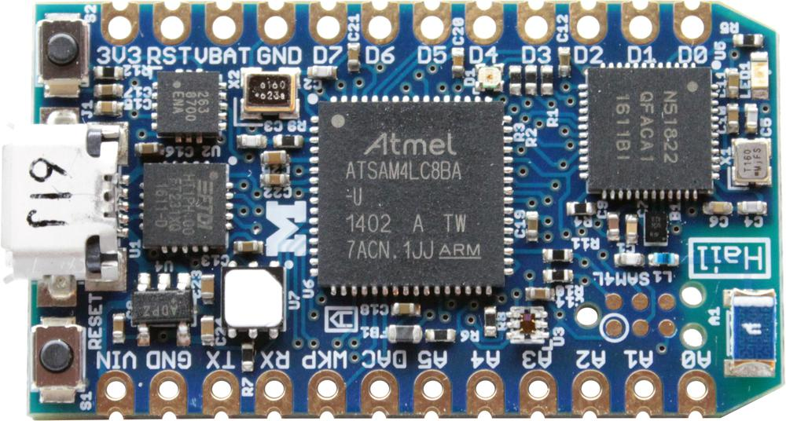

Hail: Platform-Specific Instructions
=====================================




Hail is an embedded IoT module for running Tock.
It is programmable over USB, uses BLE for wireless, includes
temperature, humidity, and light sensors, and has an onboard accelerometer.
Further, it conforms to the Particle Photon form-factor.

Setup
-----

Follow the main [Getting Started](../../doc/Getting_Started.md) to install Rust
and GCC.

Programming Hail over USB requires the `tockloader` utility. To install:

    sudo pip3 install tockloader

Connecting Hail to a computer requires a USB Micro B cable.


Programming the Tock Kernel and Apps
------------------------------------

To program the kernel for Hail:

```bash
cd tock/boards/hail
make program
```

To program an application:

```bash
cd tock/userland/examples/blink
make TOCK_BOARD=hail program
```

You can also specify the serial port to use:

```bash
make program PORT=/dev/ttyUSB0
```

