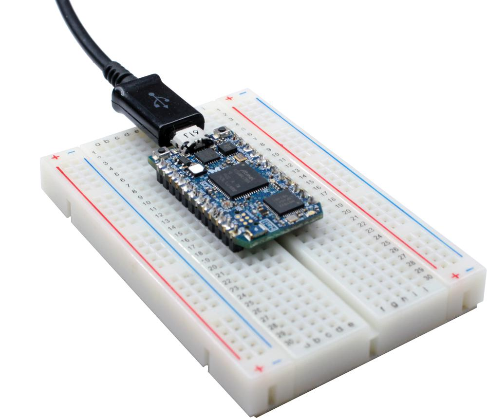

The Hail Platform
=================



Hail is an embedded IoT module for running Tock.
It is programmable over USB, uses BLE for wireless, includes
temperature, humidity, and light sensors, and has an onboard accelerometer.
Further, it conforms to the Particle Photon form-factor.

For Hail schematics or other hardware details,
[visit the Hail repository](https://github.com/lab11/hail).

Getting Started with Hail
-------------------------

In addition to the Hail hardware, you will need a Micro USB Cable to power the
Hail. Any cable will do ([here's what's on my desk](https://www.amazon.com/StarTech-com-Inch-Micro-USB-Cable/dp/B003YKX6WM/)).

Hail should come with the Tock kernel and
[the Hail test app](https://github.com/tock/libtock-c/tree/master/examples/tests/hail)
pre-loaded. When you plug in Hail, the blue LED should blink slowly (about once
per second). Pressing the User Button&mdash;just to the right of the USB
plug&mdash;should turn on the green LED.


### Connecting to Hail

The Hail board should appear as a regular serial device (e.g.
`/dev/tty.usbserial-c098e5130006` on my machine). While you can connect with
any standard serial program (set to 115200 baud), Tock ships with the
[tockloader][tockloader] utility to make programming and interfacing easier. To
install tockloader, use pip:

```bash
(Linux): sudo pip3 install --upgrade
(MacOS): pip3 install --upgrade
```

Tockloader can read attributes from connected serial devices, and will
automatically find your connected Hail. Simply run `tockloader listen`:

    $ tockloader listen
    No device name specified. Using default "tock"
    Using "/dev/cu.usbserial-c098e5130006 - Hail IoT Module - TockOS"

    Listening for serial output.
    [Hail Sensor Reading]
      Temperature:  2423 1/100 degrees C
      Humidity:     4090 0.01%
      Light:        187
      Acceleration: 1003
      ...


Tockloader has a several other useful features, such as `tockloader list` which
collects all of the applications currently installed:

    $ tockloader list
    [App 0]
      Name:                  hail
      Total Size in Flash:   65536 bytes

Check out the [tockloader homepage][tockloader] for more information on tockloader.


Running your own applications
-----------------------------

First, you will need to get your development environment set up (if you already
have `rustup` and the `arm-none-eabi-` toolchain installed, you can skip this
step).

1. Follow [Tock's Getting Started guide](../../doc/Getting_Started.md) to install Rust and GCC for Arm.

### Loading Blink

Let's replace the `hail` test app with the basic `blink` application:

2. Start with a clean slate

    `$ tockloader erase-apps`

3. Use tockloader to load a compiled version of the blink app

    `$ tockloader install blink`

The `blink` app will detect that Hail has three LED channels and rotate through
all eight colors.


### Modifying Blink

The source to blink is in the
[libtock-c](https://github.com/tock/libtock-c/tree/master/examples/blink) repo.

The stock blink app cycles a little fast for my taste. It also doesn't print
anything about what it's doing. Let's fix that. Open `main.c` and:

  * Change `delay_ms(250)` to a larger value, maybe 2000
  * Add a `printf("Hello from the Blink app!\n");` to the beginning of the
    program (also `#include <stdio.h>`)

Now run `make` and `tockloader install --make`. This will automatically rebuild
your application and then install it on Hail.


### Loading another application

One of the big advantages of Tock over traditional embedded operating systems is
that it can run multiple applications concurrently. Let's head back down into
the examples directory and install (`make && tockloader install`) the
[c_hello](https://github.com/tock/libtock-c/tree/master/examples/c_hello)
application. While we're at it, let's install
[cxx_hello](https://github.com/tock/libtock-c/tree/master/examples/cxx_hello) as
well.

Now try running `tockloader listen` &ndash; three apps running at once, cool!


### Other examples

There are a few more advanced sample applications that are worth checking out:

  * [accel-leds](https://github.com/tock/libtock-c/tree/master/examples/accel-leds)
    changes LED color based on the board's orientation
  * [ble-env-sense](https://github.com/tock/libtock-c/tree/master/examples/services/ble-env-sense)
    shows how to integrate with the onboard Bluetooth to act as an environmental
    sensor
  * [find_north](https://github.com/tock/libtock-c/tree/master/examples/find_north)
    acts as a simple compass, turning the LED on when the board is pointed north
    (the magnetometer tends to get confused in large buildings, best tried
    outdoors)


### Writing a new app

We recommend starting from an existing example app and modifying it. Building
Tock applications can be [a little complicated](../../doc/Compilation.md#compiling-a-process),
so we recommend using the Tock build system, simply a three-line Makefile in
your app:

    TOCK_USERLAND_BASE_DIR = ../..
    C_SRCS := $(wildcard *.c)
    include $(TOCK_USERLAND_BASE_DIR)/AppMakefile.mk


Hacking the Tock Kernel
-----------------------

For information on the Tock kernel itself and where to start editing, head over
to the [Tock documentation](../../doc).

Once you've made changes (or if you're simply pulling an updated kernel from
upstream), you can update the kernel via `make program`:

```bash
cd tock/boards/hail
make program
```

### Debugging the Kernel

You can use gdb to debug a running kernel. The `jlink/` folder has some scripts
designed to work with the [J-Link Debugger](https://www.segger.com/products/debug-probes/j-link/).
In one terminal run `jlink_gdbserver.sh`, and in another terminal `./gdb_session.sh`.

You may also find the `make lst` target helpful. It will generate a listings file
with disassembly of the kernel image at `target/thumbv7em-none-eabi/release/hail.lst`.


[tockloader]: https://github.com/tock/tockloader
