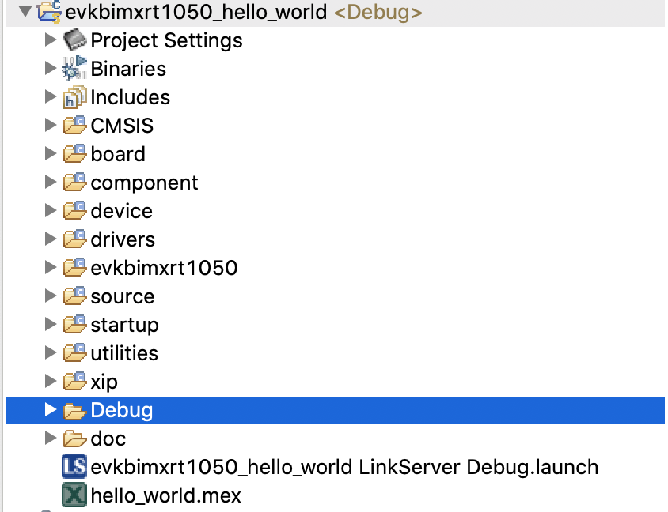
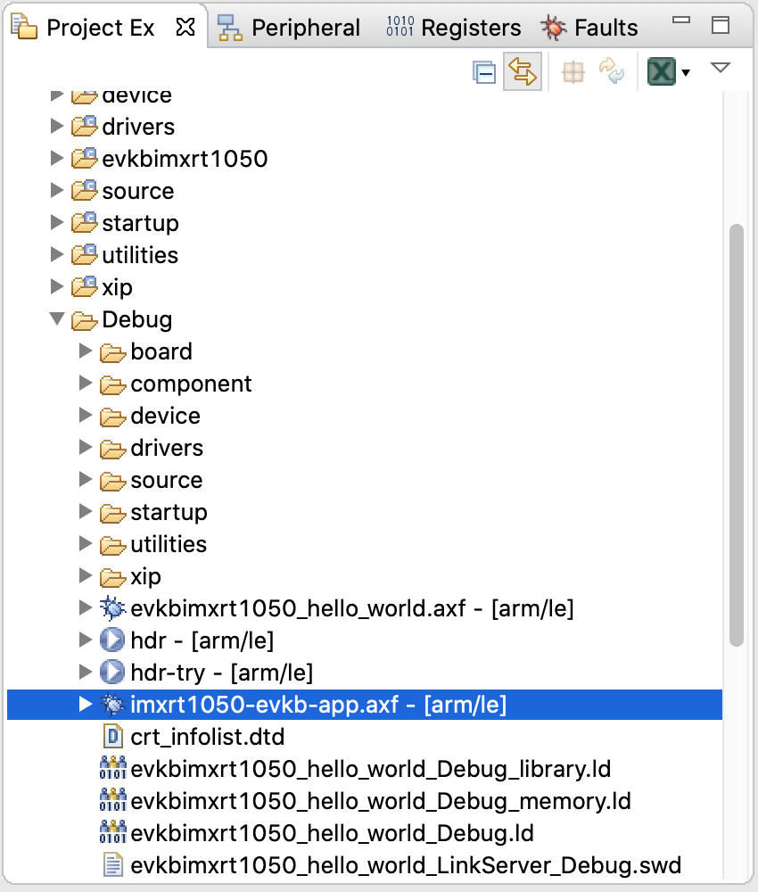
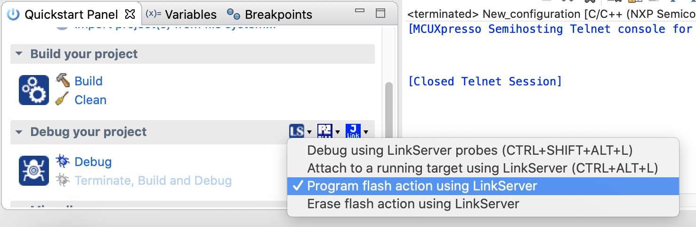
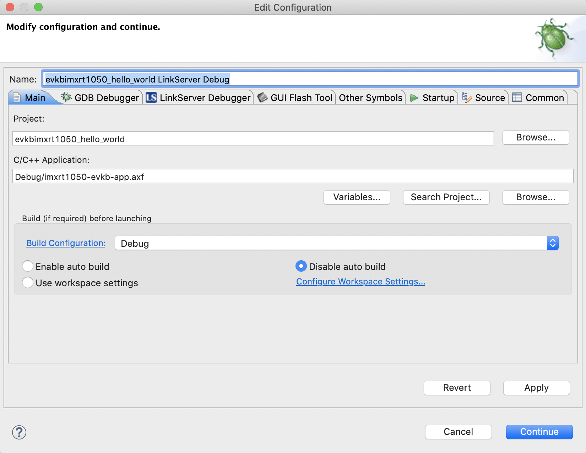

i.MX RT1050 Crossover MCU with Arm® Cortex®-M7 core
====================================================

For more details about the board [visit the NXP  board website](https://www.nxp.com/products/processors-and-microcontrollers/arm-microcontrollers/i-mx-rt-crossover-mcus/i-mx-rt1050-crossover-mcu-with-arm-cortex-m7-core:i.MX-RT1050).


## Building the app

Apps are built out-of-tree. Once an app is built, you can use
`arm-none-eabi-objcopy` with `--update-section` to create an ELF image with the
apps included.

```bash
$ arm-none-eabi-objcopy  \
    --update-section .apps=../../../libtock-c/examples/c_hello/build/cortex-m7/cortex-m7.tbf \
    target/thumbv7em-none-eabi/debug/imxrt1050-evkb.elf \
    target/thumbv7em-none-eabi/debug/imxrt1050-evkb-app.axf
```

For example, you can update `Makefile` as follows.

```
APP=../../../libtock-c/examples/c_hello/build/cortex-m7/cortex-m7.tbf
KERNEL=$(TOCK_ROOT_DIRECTORY)/target/$(TARGET)/debug/$(PLATFORM).elf
KERNEL_WITH_APP=$(TOCK_ROOT_DIRECTORY)/target/$(TARGET)/debug/$(PLATFORM)-app.axf

.PHONY: program
program: target/$(TARGET)/debug/$(PLATFORM).elf
	arm-none-eabi-objcopy --update-section .apps=$(APP) $(KERNEL) $(KERNEL_WITH_APP)
	$(warning Tock OS was compiled. In order to flash it on the board, you will need MCUExpresso. See README.md for details.)
```

After setting `APP`, `KERNEL`, `KERNEL_WITH_APP`, and `program` target
dependency, you can do

```bash
$ make program
```

to build the tock image.

## Flashing the app
Prerequirements: You will need to have the MCU Expresso and the SDK for the IMXRT1050 board installed on your computer.

First step: Import a Hello World example project from the SDK and build the project. This way you will have the following file hierarchy in the Project Explorer Tab:



Second step: Copy the app image from target/thumbv7em-none-eabi/debug/imxrt1050-evkb-app.axf to the Debug folder in MCU Expresso (via drag and drop):



Next, flash the example program once in order to generate the LinkServer Debug file, like this:



Next step, modify the LinkServer Debug, like this: 

- From Search Project, select the imxrt1050-evkb-app.axf file you copied earlier
- Check the "Disable auto build" option
- Press Apply and Continue



Finally, press debug to run the code on the board and enjoy!


