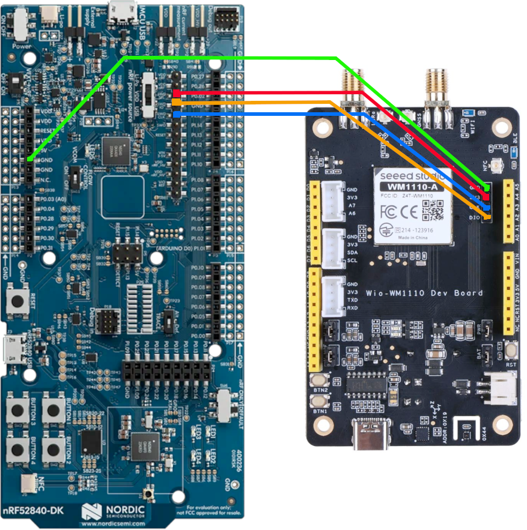

Wio WM1110 Development Board
===================


The [Wio WM1110 Development
Board](https://www.seeedstudio.com/Wio-WM1110-Dev-Kit-p-5677.html) is a
multiradio location board for LoRa and location services based on the Nordic
nRF52840 SoC. The board includes the following hardware:

- LIS3DHTR: 3-Axis accelerometer
- SHT41: Temperature and humidity sensor
- Semtech LR1110
  - LoRaWAN
  - GNSS
  - WiFi AP Scanning


## Getting Started

First, follow the [Tock Getting Started guide](../../doc/Getting_Started.md).

The WM1110 is designed to be programmed using an external JLink programmer. We
would like to avoid this requirement, so we use the [Tock
Bootloader](https://github.com/tock/tock-bootloader) which allows us to program
the board over the UART connection. However, we still require the programmer one
time to flash the bootloader.

To flash the bootloader we must connect a JLink programmer. The easiest way is
to use an nRF52840dk board.

### Connect the nRF52840dk to the WM1110-dev

First we jumper the board as shown here:



Pin mappings:

| nRF52840dk | WM1110-dev |
|------------|------------|
| GND        | GND        |
| SWD SEL    | 3V3        |
| SWD CLK    | CLK        |
| SWD IO     | DIO        |

Make sure _both_ the nRF52840dk board and the WM1110-dev board are attached to
your computer via two USB connections.

> Tip: If you only have one USB cable, plug it into the nRF52840dk. Then, jumper
> `3V3 (wm1110dev) <-> VDD (nrf)` and `SWD SEL (nrf) <-> VDD (nrf)`. The other
> jumpers remain the same.

Then:

```
make flash-bootloader
```

This will use JLinkExe to flash the bootloader using the nRF52840dk's onboard
jtag hardware.

### Using the Bootloader

The bootloader activates when the reset button is pressed twice in quick
succession. The green LED will stay on when the bootloader is active.

Once the bootloader is installed tockloader will work as expected.
