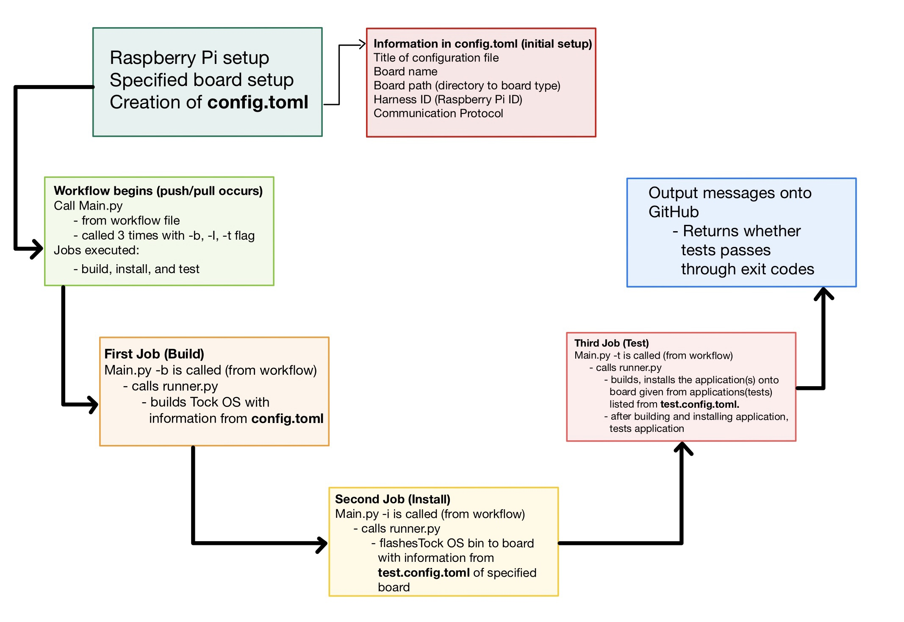
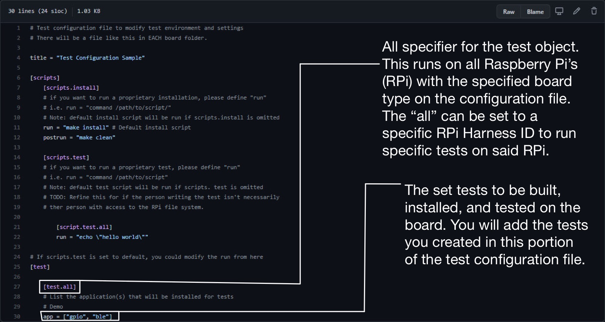

# Tock Hardware-in-the-Loop CI
In addition to software tests, Tock allows platform maintainers to deploy CI runners for hardware platforms, to ensure continuous on-metal performance correctness. The hardware CI is federated, and maintainers for each hardware platform are responsible for ensuring that their hardware CI system is set up, accessible, and runs correctly.

The Tock core team maintains the following hardware CI instances:
- [Nrf52840dk](../boards/nordic/nrf52840dk)	UC San Diego; contact: Pat Pannuto <ppannuto@ucsd.edu>, Anthony Quiroga <aquiroga@ucsd.edu> 
- [Hail (WIP)](https://github.com/tock/tock/tree/master/boards/hail)	UC San Diego; contact: Pat Pannuto <ppannuto@ucsd.edu>, Anthony Quiroga <aquiroga@usd.edu>

<!-- toc -->

- [How To Set Up a New Instance](#how-to-set-up-a-new-instance)
  * [Getting Started ([Source](https://goodoomoodoo.github.io/tock-test-harness/GUIDE))](#getting-started-source)
  * [Troubleshoot](#troubleshoot)
    + [To run on your local-host (instead of Github)](#to-run-on-your-local-host-instead-of-github)
    + [WiFi not connected after first boot](#wifi-not-connected-after-first-boot)
    + [Action runner: **command not found**](#action-runner-command-not-found)
  * [Creating the Configuration File](#creating-the-configuration-file)
- [How Instances Work](#how-instances-work)
  * [Process of Instances](#process-of-instances)
    + [What are actions/runners?](#what-are-actionsrunners)
  * [Configuration Files](#configuration-files)
  * [Looking in the Workflow ([tock-hw-ci.yml](https://github.com/goodoomoodoo/tock/blob/master/.github/workflows/tock-hw-ci.yml))](#looking-in-the-workflow-tock-hw-ciyml)
- [Where Tests are Located and How They Work](#where-tests-are-located-and-how-they-work)
  * [Location](#location)
  * [How Tests Work (Example - [gpio folder](https://github.com/goodoomoodoo/libtock-c/tree/master/examples/ci-tests/gpio))](#how-tests-work-example---gpio-folder)
- [How Tests are Chosen](#how-tests-are-chosen)
- [What to do if Something Goes Wrong](#what-to-do-if-something-goes-wrong)
  * [If a test fails](#if-a-test-fails)
  * [If there’s boot up issues of the Raspberry Pi](#if-theres-boot-up-issues-of-the-raspberry-pi)

<!-- tocstop -->


# How To Set Up a New Instance

You will need a local machine to run the unit tests that is attached to the Tock development board under test.

This section explains the software setup needed for this box. These directions assume you are using a Raspberry Pi (RPi), which will likely be easiest as there are already pins and drivers for GPIO, SPI, and I2C testing available for RPis, but in principle, any Linux-like platform should work.

**Note:** This machine should be on a stable, reliable network (i.e. a campus or office setup) to ensure it is always available to run tests. Also of note, runners may run arbitrary code from community-generated Pull Requests (PRs), which may create a security risk. Once initial configuration is complete, the only network access the runner should need is to Github servers, so this box can be firewalled accordingly.

## Getting Started ([Source](https://goodoomoodoo.github.io/tock-test-harness/GUIDE))

1. Install Ubuntu Server on Raspberry Pi.
    * Follow the guide [here](https://ubuntu.com/tutorials/how-to-install-ubuntu-on-your-raspberry-pi#1-overview) until step 5. We do not need desktop environment.
2. Install the [Requirements](https://github.com/tock/tock/blob/master/doc/Getting_Started.md#requirements) here.
3. Download and install JLinkExe
```bash
$ wget --post-data 'accept_license_agreement=accepted&non_emb_ctr=confirmed&submit=Download+software' https://www.segger.com/downloads/jlink/JLink_Linux_arm64.tgz
$ tar xvf JLink_Linux_arm64.tgz
$ sudo cp JLink_Linux_V700a_arm64/99-jlink.rules /etc/udev/rules.d/ # Depends on JLink version
 
# Add the Jlink directory to the path in .profile or .bashrc
# Example command below (not exact command)
$ echo 'export PATH=/usr/local/bin:$PATH' >> ~/.bash_profile
```
4. Install pip3, if not yet installed
```bash
sudo apt install python-pip3
```
5. Checkout test harness in home directory 
```bash
cd ~; git clone https://github.com/goodoomoodoo/tock-test-harness.git
cd ~; git clone https://github.com/goodoomoodoo/libtock-c.git
```
6. Install gpiozero if not yet installed. (It should come with the image)
```bash
$ sudo apt install python3-gpiozero
$ sudo chown root:$USER /dev/gpiomem
$ sudo chmod g+rw /dev/gpiomem
```
7. Install linux library
```bash
$ sudo apt install arm-none-eabi
# Install bluetooth library
$ sudo apt-get install bluez bluez-tools pi-bluetooth 
# !IMPORTANT! Remember to reboot after installation
$ sudo reboot
```
8. Install python3 libraries
```bash
$ cd ~/tock-test-harness; pip3 install -r requirements.txt
```
**Note:** this step will have to be done by a member of @tock/core-wg
9. Hook up Action Runner of the Tock Repo to the Raspberry Pi.
    * Go to \'Settings\' and go to \'Actions\' down the list on the left
    * Under \'Self-hosted runners\' click **Add runner**
    * Follow the steps to set up action runner on Raspberry Pi

10. Add path to JLink to ```.path``` in Action Runner
```bash
$ echo "JLINK_PATH_WHATEVER_IT_IS" > ~/actions-runner/.path
```

## Troubleshoot
### To run on your local-host (instead of Github)

Make sure to add "self-hosted" as a label in runs-on for the job:

```
jobs:
  "job name":
    runs-on: self-hosted
 ```

### WiFi not connected after first boot

1. Configure network plan ```sudo vi /etc/netplan/50-cloud-init.yaml```

```yaml
# This file is generated from information provided by the datasource. Changes
# to it will not persist across an instance reboot. To disable cloud-init's
# network configuration capabilities, write a file
# /etc/cloud/cloud.cfg.d/99-disable-network-config.cfg with the following:
# network: {config: disabled}
network:
    ethernets:
        eth0:
            dhcp4: true
            optional: true
    version: 2
    wifis:
        wlan0:
            dhcp4: true
            optional: true
            access-points:
                "SSID_name":
                    password: "WiFi_password"
```
2. Generate and apply new network plan
```sudo netplan generate; sudo netplan apply```

### Action runner: **command not found**

If you experience issue with the command not being found, but you are very sure that you have installed the corresponding software. Try to uninstall the runner and reinstall it.

```bash
# 1. Uninstall Action Runner Server
$ cd ~/actions-runner
$ sudo ./svc.sh stop
$ sudo ./svc.sh uninstall
$ ./config.sh remove

# 2. Reinstall Action Runner Server
# Follow the guide in Getting Started.
```
**Note**: Possible reason to this issue is that the server environment and path varaible cannot be update after it has started. Thus, it requires a reconfiguration to included the updated path and environment variables.

## Creating the Configuration File
After all is set up, the first step in creating an instance is to run the [runner_init](https://github.com/goodoomoodoo/tock-test-harness/blob/main/runner_init.py) script to create a configuration file for the raspberry pi you just set up.
This configuration file will then be used in the workflow of actions for github whenever an update is pushed to be accessed by the runners, which will be denoted as config.toml for simplicity sake here.

What this **configuration file** contains is:
- Title
    - Name of the configuration. 
    - This can be anything you want but make sure to title it appropriately.
- Board name
    - This will be provided when the executable is called on what boards are supported. Choose which board you are using that is supported. You can NOT use a board that is not supported by the Tock OS. 
- Board Path
    - This is the path of the Tock supported board in the official tock repository. The path must be provided when setting up the configuration. This is essentially the directory relative to the Tock boards directory. 
- Harness ID
    - This is the specific Identity Number of the Raspberry Pi. This will be used in the test.config.toml which is kept for each board type to run tests on in the runner. 
- Communication Protocol 
    - Used to run tockloader
    - The list of communication protocols are provided, and one chosen must be in the list. 
        - Typically Jlink is the one chosen here

When runner_init script is executed, there will be prompts to fill in this information and the configuration file will be created based on the responses, filling in the file with the information listed above.

# How Instances Work
Instances in this case are workflows with Github actions that set runners to complete said actions. This is how testing is conducted in Hardware Continuous Integration. The entire process is taken within the workflow through the yml files, which are another type of configuration file. Currently using the tock-hw-ci.yml as the workflow to run tests, in which we will use as an example throughout this document. (This file is located [here](https://github.com/goodoomoodoo/tock/blob/master/.github/workflows/tock-hw-ci.yml))

## Process of Instances
As stated instances work through GitHub actions that set up runners. These are called workflows, and are set to call whenever a specific action occurs.

### What are actions/runners?
Github actions are automated tasks that the user sets up for software development. These actions are event-driven, meaning that the tasks, or set of commands, are run after a specified event has occurred. In our case, this would be everytime someone pushes changes to the repository to update software to certain Tock supported boards, and this would automatically run tasks that execute tests to verify such updates work as intended. 

Github actions can be used to set up runners, which are [servers that have the GitHub Actions runner application installed.](https://docs.github.com/en/actions/learn-github-actions/introduction-to-github-actions) Runners can be run through the github server, or be hosted by the user locally, which we typically do the latter. A runner listens for jobs, does one job at a time, and reports progress and results back to github, keeping all information at one place for convenience. 

## Configuration Files
Before looking at the workflow, there are two configuration files that are important to the whole process of hardware CI and how it’s currently working through the main executable file that is called to run on runners. The two configuration files are:
- **Config.toml**
    - This file is created when runner_init, the script used when setting up the Raspberry Pi, is run, which holds information about the target board and the harness id of the Raspberry Pi. Information that is held in this file was explained in the previous section ([Here](#creating-the-configuration-file)).
- **Test.config.toml** (located [here - nrf52840dk board](https://github.com/goodoomoodoo/tock/blob/master/boards/nordic/nrf52840dk/test.config.toml)) Note: Each specific board will have this file when Hardware CI is implemented for said board.
    - This configuration file is made for each board that is supported by the Tock OS that has Hardware CI set. Currently, the only board that has this file is the nrf52840dk board. This toml file contains board-specific test information, such as what tests are run for all Raspberry Pi’s, and what tests are to be performed on specific Raspberry Pi's harness ID. Note that the current setting for run is the default install script which can be changed to other scripts. Each test configuration file for each board will have a file in this format, and it’s necessary to be able to run tests.
    - **The file contains**
        - Script Object:
            - Script.install specifier:
                - Script for installing Tock OS into Raspberry Pi. “run” variable holds the install script, and “make install” is the default.
            - Script.test.all specifier:
                - Script for pre/post run installations for testing on the raspberry pi. Default runs if script.test is not specified. The all in the specifier denotes this test script to run on all Raspberry Pi’s with this board.
        - Test Object:
            - Test.all specifier:
                - Tests to be built, installed, and tested on the raspberry pi. The “app” variable holds the list of tests to be conducted. The “all” in the specifier can be changed to a Raspberry Pi ID to conduct specific tests on specific Raspberry Pi’s.

## Looking in the Workflow ([tock-hw-ci.yml](https://github.com/goodoomoodoo/tock/blob/master/.github/workflows/tock-hw-ci.yml))

These files are the workflow of how instances work, setting up actions that create runners to run certain tasks or files.
These configuration files call the python executables located at each directory listed, known as “main.py”, through the workflow/runners.
The main.py file is the central part of how instances work, and it takes an argument for each job of the workflow, which are build, install, and test.
For example: 
- The workflow listed below is set to run when pushes or pull requests are called, then the listed jobs are executed.
- There are three jobs when the workflow is called to be executed. These jobs are: Build, Install, and test. Each job requires the previous job to be executed. Remember, each job is performed one at a time. Thus, the chronological order of each job is important as it’s necessary to build, install, and test in this exact order.
- **Build**
    - This job goes to the directory path to execute Main.py with the “-b” flag. The Main (located [here](https://github.com/goodoomoodoo/tock-test-harness/blob/main/lib/main.py)) file then calls the runner file (located [here](https://github.com/goodoomoodoo/tock-test-harness/blob/main/lib/Runner.py)), which contains the functions to actually build, install, and test the Raspberry Pi with the specific board setup. In this case, the build flag, “-b”, is the argument when calling main, which calls the Tock_build function in Runner.py, setting up the Tock OS on the board with the specific configuration settings from config.toml file, the configuration file made from runner_init. 
- **Install**
    - When this job runs, it executes Main.py with the “-i” flag to run the install functions in Runner.py. This flag calls the Tock_install function which flashes the Tock OS bin to the board using information from the board-specific configuration test file, or test.config.toml. You can use the nrf52380dk board’s test configuration file as reference to view what information is held in the file. For install, the Tock_install function uses the run variable in the script object to flash the board and uses the postrun variable in the script to conduct a post-run installation script. A pre-install script can be created for the test configuration to be conducted as well, but this current board’s configuration file does not have this implemented.
- **Test**
    - When this job runs, it executes Main.py with the “-t” flag, calling the tock_test function in Runner.py. This function builds the tests by compiling them, installs the tests to the board, then runs the tests on the board. The tests to be installed are designated by the test.config.toml file for each board. Currently, for the board we have set up for hardware CI, nrf52840dk, we have the test object have an “all” specifier in the test.config.toml file that  runs a set of tests for all boards of this type, regardless of harness ID of the RPi. We can set, later, for the test object to have certain Harness ID’s and Raspberry Pi’s run certain tests.  The runner.py, then, runs all the tests specified in the “test” object of the test configuration file for the specific Raspberry Pi and respective board. Through this process, this is how the tests are conducted on the board. 

# Where Tests are Located and How They Work

## Location
The tests are located in the “libtock-c” repository, and there is a list of tests held in the directory [libtock-c/examples/ci-tests](https://github.com/goodoomoodoo/libtock-c/tree/master/examples/ci-tests). Tests are held in each folder, and the labels of each folder are the kind of tests programmed to run. For example, ble folder represents the ble test. To explain how the tests work with the multiple files for each test folder, I’ll use the gpio test as reference.

## How Tests Work (Example - [gpio folder](https://github.com/goodoomoodoo/libtock-c/tree/master/examples/ci-tests/gpio))
There are two files for each test that are used for the actual process of testing, one makefile for the installation of the application onto the board/Raspberry Pi, and readme to explain the test. 
- Main.c (located [here](https://github.com/goodoomoodoo/libtock-c/blob/master/examples/ci-tests/gpio/main.c)):
    - This file is what’s used to install the test, or application, onto the target board. This goes for all main files for the test folders. What this application does is toggle the gpio state for a certain period of time.
- Gpio_test.py (located [here](https://github.com/goodoomoodoo/libtock-c/blob/master/examples/ci-tests/gpio/gpio_test.py)):
    - What this file does is monitor the state, the message, or the action on the target board. This goes for all python files for the test folders. What this specific python program does is that it is monitoring the gpio state, and reading into it, on the target board and gathering any meaningful information to dump. 
    - In sum, the main file will install the application onto the target board, and the test file, the python file, will be used to monitor the target board, reading for any messages, state, or action that is meaningful. The test is the process of running both of these files onto the target board, and compiling any messages from the python file to determine whether it succeeds or fails the test. 

This is the workflow of how instances work through Hardware CI. Ideally, every board will have this workflow to be called whenever updates occur and follow this form processing. 


# How Tests are Chosen
Tests are chosen when initially running the program through the setup/configuration of the Raspberry Pi, where you build a configuration file that is run through the runners and when creating the file. Essentially, when setting up the Raspberry Pi, you create a configuration file on boot up with the get started guide listed that sets the specified board type, and that board type will have a test configuration file containing the tests for all boards of that type and/or the specific Raspberry Pi through the harness Identity number. Then, tests are chosen for the specified board that is supported by the Tock OS.
As noted in the previous section we have a test.config.toml file that contains information of the test to run for each board in the Tock/Boards directory , which contains each specific Tock supported board as well. Thus to Add tests, there are two primary steps:
- **Adding Tests**
    1. To add tests, you’ll need to create two files: a main.c (c) file and a test.py (python) file.
        - The c file will be titled “main” which is the application to be used to test on the target board. For more information on this file and what it does, look at the section How instances work - How tests work.
        - The python file will be named “test” which is the file that reads into any information from the application, and outputs any messages that are meaningful. This information can be the state, action, or messages from the application onto the target board.
        - Then, you can create a readme and makefile corresponding to the test to explain what functions are being tested on the board and to compile/build the application (test) for the board.
        - To add the test, you’ll push the files of the test with the title of the function being tested to the directory path libtock-c/examples/ci-tests in github. The full path will then be libtock-c/examples/ci-tests/{app} with “{app}” being the title to the test you made as the folder. This is necessary because the “main.py” file uses the path to build, install, and run the test.
    2. To add the tests to the boards you want to test, you’ll need to go to the specific board in Tock/Boards directory ([Official Tock Repository](https://github.com/tock/tock/tree/master/boards/nordic) or [Forked Repository  w/ file](https://github.com/goodoomoodoo/tock/tree/master/boards/nordic/nrf52840dk)), and in the boards directory, you’ll either edit, or create, the test.config.toml file for that board. There, you’ll go to the test object, or create one, and either add it to the “all” specifier for all raspberry Pi’s to run the test, or add the test to specific Raspberry Pi’s by making the specifier for the test object be the identity number of said raspberry pi. To see what’s included currently in the test configuration file for each board, visit the nrf52840dk board [here](https://github.com/goodoomoodoo/tock/blob/master/boards/nordic/nrf52840dk/test.config.toml) to see the contents and format. Also revisit the previous section discussing the test configuration file [here](#configuration-files).



# What to do if Something Goes Wrong

## If a test fails
Take a look at what type of test failed (in the output on github) and see what is the issue of the build of the board accordingly. The output in github currently prints what test failed to give the user a better understanding of what’s wrong in the installation.

## If there’s boot up issues of the Raspberry Pi
Go to the [Troubleshooting section](#troubleshoot)

**Further updates here will be made accordingly to new issues that arise.** 