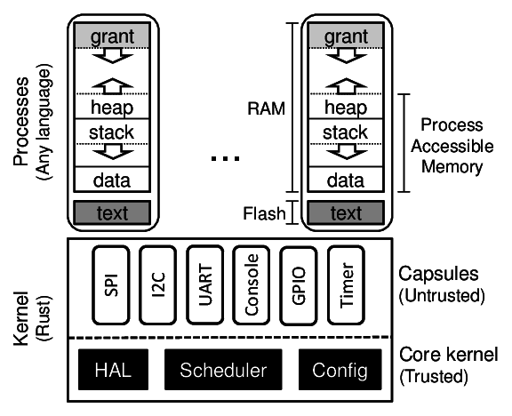

Tock Design
===========

<!-- npm i -g markdown-toc; markdown-toc -i Design.md -->

<!-- toc -->

- [Architecture](#architecture)
  * [Capsules](#capsules)
  * [Processes](#processes)
    + [Memory Layout](#memory-layout)
  * [Grants](#grants)
- [In-Kernel Design Principles](#in-kernel-design-principles)
  * [Role of HILs](#role-of-hils)
  * [Split-phase Operation](#split-phase-operation)
  * [No External Dependencies](#no-external-dependencies)
  * [Using `unsafe` and Capabilities](#using-unsafe-and-capabilities)
  * [Ease of Use and Understanding](#ease-of-use-and-understanding)
  * [Demonstrated Features](#demonstrated-features)
  * [Merge Aggressively, Archive Unabashedly](#merge-aggressively-archive-unabashedly)

<!-- tocstop -->

Most operating systems provide isolation between components using a process-like
abstraction: each component is given it's own slice of the system memory (for
it's stack, heap, data) that is not accessible by other components. Processes
are great because they provide a convenient abstraction for both isolation and
concurrency. However, on resource-limited systems, like microcontrollers with
much less than 1MB of memory, this approach leads to a trade-off between
isolation granularity and resource consumption.

Tock's architecture resolves this trade-off by using a language sandbox to
isolated components and a cooperative scheduling model for concurrency in the
kernel. As a result, isolation is (more or less) free in terms of resource
consumption at the expense of preemptive scheduling (so a malicious component
could block the system by, e.g., spinning in an infinite loop).

To first order, all component in Tock, including those in the kernel, are
mutually distrustful. Inside the kernel Tock, achieves this with a
language-based isolation abstraction called _capsules_ that incurs no memory or
computation overhead. In user-space, Tock uses (more-or-less) a traditional
process model where process are isolated from the kernel and each other using
hardware protection mechanisms.

In addition, Tock is designed with other embedded systems-specific goals in
mind. Tock favors overall reliability of the system and discourages components
(prevents when possible) from preventing system progress when buggy.

## Architecture

Tock includes three architectural components. A small trusted kernel, written in
Rust, implements a hardware abstraction layer (HAL), scheduler and
platform-specific configuration. Other system components are implemented in one
of two protection mechanisms: capsules, which are compiled with the kernel and
use Rust’s type and module systems for safety, and processes, which use the MPU
for protection at runtime.

System components (an application, driver, virtualization layer, etc.) can be
implemented in either a capsule or process, but each mechanism trades off
concurrency and safety with memory consumption, performance, and granularity.

| Category               | Capsule     | Process        |
| ---------------------- | ----------- | -------------- |
| Protection             | Language    | Hardware       |
| Memory Overhead        | None        | Separate stack |
| Protection Granularity | Fine        | Coarse         |
| Concurrency            | Cooperative | Preemptive     |
| Update at Runtime      | No          | Yes            |

As a result, each is more appropriate for implementing different components. In
general, drivers and virtualization layers are implemented as capsules, while
applications and complex drivers using existing code/libraries, such as
networking stacks, are implemented as processes.

### Capsules

A capsule is a Rust struct and associated functions. Capsules interact with each
other directly, accessing exposed fields and calling functions in other
capsules. Trusted platform configuration code initializes them, giving them
access to any other capsules or kernel resources they need. Capsules can protect
internal state by not exporting certain functions or fields.

Capsules run inside the kernel in privileged hardware mode, but Rust’s type and
module systems protect the core kernel from buggy or malicious capsules. Because
type and memory safety are enforced at compile-time, there is no overhead
associated with safety, and capsules require minimal error checking. For
example, a capsule never has to check the validity of a reference. If the
reference exists, it points to valid memory of the right type. This allows
extremely fine-grained isolation since there is virtually no overhead to
splitting up components.

Rust’s language protection offers strong safety guarantees. Unless a capsule is
able to subvert the Rust type system, it can only access resources explicitly
granted to it, and only in ways permitted by the interfaces those resources
expose. However, because capsules are cooperatively scheduled in the same
single-threaded event loop as the kernel, they must be trusted for system
liveness. If a capsule panics, or does not yield back to the event handler, the
system can only recover by restarting.

### Processes

Processes are independent applications that are isolated from the kernel and run
with reduced privileges in separate execution threads from the kernel. The
kernel schedules processes preemptively, so processes have stronger system
liveness guarantees than capsules. Moreover, uses hardware protection to enforce
process isolation at runtime. This allows processes to be written in any
language and to be safely loaded at runtime.

#### Memory Layout

Processes are isolated from each other, the kernel, and the underlying hardware
explicitly by the hardware Memory Protection Unit (MPU). The MPU limits which
memory addresses a process can access. Accesses outside of a process’s permitted
region result in a fault and trap to the kernel.

Code, stored in flash, is made
accessible with a read-only memory protection region. Each process is allocated
a contiguous region of RAM. One novel aspect of a process is the presence of a
“grant” region at the top of the address space. This is memory allocated to the
process covered by a memory protection region that the process can neither read
nor write. The grant region, discussed below, is needed for the kernel to be able
to borrow memory from a process in order to ensure liveness and safety in
response to system calls.

### Grants

Capsules are not allowed to allocate memory dynamically since dynamic
allocation in the kernel makes it hard to predict if memory will be exhausted.
A single capsule with poor memory management could cause the rest of the kernel
to fail. Moreover, since it uses a single stack, the kernel cannot easily
recover from capsule failures.

However, capsules often need to dynamically allocate memory in response to
process requests. For example, a virtual timer driver must allocate a structure
to hold metadata for each new timer any process creates. Therefore, Tock allows
capsules to dynamically allocate from the memory of a process making a request.

It is unsafe, though, for a capsule to directly hold a reference to process
memory. Processes crash and can be dynamically loaded, so, without explicit
checks throughout the kernel code, it would not be possible to ensure that a
reference to process memory is still valid.

For a capsule to safely allocate memory from a process, the kernel must enforce
three properties:

  1. Allocated memory does not allow capsules to break the type system.

  2. Capsules can only access pointers to process memory while the process is
     alive.

  3. The kernel must be able to reclaim memory from a terminated process.

Tock provides a safe memory allocation mechanism that meets these three
requirements through memory grants. Capsules can allocate data of arbitrary
type from the memory of processes that interact with them. This memory is
allocated from the grant segment.

Just as with buffers passed through allow, references to granted memory are
wrapped in a type-safe struct that ensures the process is still alive before
dereferencing. Unlike shared buffers, which can only be a buffer type in a
capsule, granted memory can be defined as any type. Therefore, processes cannot
access this memory since doing so might violate type-safety.

## In-Kernel Design Principles

To help meet Tock's goals, encourage portability across hardware, and ensure a
sustainable operating system, several design principles have emerged over time
for the Tock kernel. These are general principles that new contributions to the
kernel should try to uphold. However, these principles have been informed by
Tock's development, and will likely continue to evolve as Tock and the Rust
ecosystem evolve.

### Role of HILs

Generally, the Tock kernel is structured into three layers:

1. Chip-specific drivers: these typically live in a crate in the
   `chips` subdirectory, or an equivalent crate in an different repository
   (e.g. the Titan port is out of tree but its `h1b` create is the
   equivalent here). These drivers have implementations that are specific
   to the hardware of a particular microcontroller. Ideally,
   their implementation is fairly simple, and they merely adhere to a
   common interface (a HIL). That's not always the case, but that's
   the ideal.

2. Chip-agnostic, portable, peripheral drivers and subsystems. These
   typically live in the `capsules` crate. These includes things like
   the virtual alarms and virtual I2C stack, as well as drivers for
   hardware peripherals not on the chip itself (e.g. sensors, radios,
   etc). These drivers typically rely on the chip-specific drivers
   through the HILs.

3. System call drivers, also typically found in the `capsules`
   crate. These are the drivers that implement a particular part of
   the system call interfaces, and are often even more abstracted from
   the hardware than (2) - for example, the temperature sensor system
   call driver can use any temperature sensor, including several
   implemented as portable peripheral drivers.

   The system call interface is another point of
   standardization that can be implemented in various ways. So it’s
   perfectly reasonable to have several implementations of the same
   system call interface that use completely different hardware
   stacks, and therefore HILs and chip-specific drivers (e.g. a
   console driver that operates over USB might just be implemented as
   a different system call driver that implements the same system
   calls, rather than trying to fit USB into the UART HIL).

The connective tissue between layers are the HILs. The HIL interfaces
are portable interfaces that are implemented in a non-portable way.

The choice of particular HIL interfaces is pretty important, and we
have some general principles we follow:

1. HIL implementations get to assume this HIL is the only way the device will be
   used. As a result, Tock tries to avoid having several HILs that provide
   different interfaces to similar resources, because it will not, in general,
   be possible for multiple drivers to use different HILs for the same device
   simultaneously. For example, two separate HIL traits could exist for the ADC:
   one that only provides single samples and one that allows for repeated,
   periodic samples. If the two interfaces provide access to the same hardware
   and are used simultaneously, likely one would corrupt the settings of the
   other, and at least one of the interfaces would not function correctly.

2. HIL implementations should be fairly general. If we have an interface that
   doesn't work very well across different hardware, we probably have the wrong
   interface - it's either too high level, or too low level, or it’s just not
   flexible enough. But HILs shouldn't generally be designed to optimize for
   particular applications or hardware, and definitely not for a particular
   combination of applications and hardware. If there are cases where that is
   really truly necessary, a driver can be very chip or board specific and
   circumvent the HILs entirely.

   Sometimes there are useful interfaces that some chips can provide natively,
   while other chips lack the necessary hardware support, but the functionality
   could be emulated in some way. In these cases, Tock sometimes uses
   "advanced" traits in HILs that enable a chip to expose its more
   sophisticated features while not requiring that all implementors of the HIL
   have to implement the function. For example, the UART HIL includes a
   `ReceiveAdvanced` trait that includes a special function
   `receive_automatic()` which receives bytes on the UART until a pause between
   bytes is detected. This is supported directly by the SAM4L hardware, but can
   also be emulated using timers and GPIO interrupts. By including this in an
   advanced trait capsules can still use the interface but other UART
   implementations that do not have that required feature do not have to
   implement it.

### Split-phase Operation

While processes are time sliced and preemptive in Tock, the kernel is
not. Everything is run-to-completion. That is an important design
choice because it allows the kernel to avoid allocating lots of stacks
for lots of tasks, and it makes it possible to reason more simply
about static and other shared variables.

Therefore, all I/O operations in the Tock kernel are asynchronous and
non-blocking. A method call starts an operation and returns immediately. When
the operation completes, the struct implementing the operation calls a callback.
Tock uses callbacks rather than closures because closures typically require
dynamic memory allocation, which the kernel avoids and does not generally
support.

This design does add complexity when writing drivers as a blocking API is
generally simpler to use. However, this is a conscious choice to favor overall
safety of the kernel (e.g. avoiding running out of memory or preventing other
code from running on time) over functional correctness of individual drivers
(because they might be more error-prone, not because they cannot be written
correctly).

There are limited cases when the kernel can briefly block. For example, the
SAM4L's GPIO controller can take up to 5 cycles to become ready between
operations. Technically, a completely asynchronous driver would make this
split-phase: the operation returns immediately, and issues a callback when it
completes. However, because just setting up the callback will take more than 5
cycles, spinning for 5 cycles is not only simpler, it's also cheaper. The
implementation therefore spins for a handful of cycles before returning, such
that the operation is synchronous. These cases are rare, though: the operation
has to be so fast that it's not worth allowing other code to run during the
delay.

### No External Dependencies

Tock chooses to not use any external libraries for any of the crates in the
kernel. This is done to promote safety, as auditing the Tock code only requires
inspecting the code in the Tock repository. Tock tries to be very specific with
its use of `unsafe`, and tries to ensure that when it is used it is clear as to
why. With external dependencies it would be significantly more challenging to
ensure that uses of `unsafe` are valid, particularly as external libraries
evolve.

We also realize, however, that external libraries can be very useful. Tock's
compromise has been to pull in specific portions of libraries into the
`libraries` folder. This puts the library's source in the same repository, while
keeping the library as a clearly separate crate. We do try to limit how often
this happens.

In the future, we hope that `cargo` and other Rust tools make it significantly
easier to audit and manage dependencies. For example, cargo currently has no
mechanism to emit an error if a dependency uses `unsafe`. If new tools emerge
that help ensure that dependent code is safe, Tock would likely be able to
leverage external dependencies.

### Using `unsafe` and Capabilities

Tock attempts to minimize the amount of unsafe code in the kernel. Of course,
there are a number of operations that the kernel must do which fundamentally
violate Rust's memory safety guarantees, and we try to compartmentalize these
operations and explain how to use them in an ultimately safe manner.

For operations that violate Rust safety, Tock marks the functions, structs, and
traits as `unsafe`. This restricts the crates that can use these elements.
Generally, Tock tries to make it clear where an unsafe operation is occurring by
requiring the `unsafe` keyword be present. For example, with memory-mapped
input/output (MMIO) registers, casting an arbitrary pointer to a struct that
represents those registers violates memory safety unless the register map and
address are verified to be correct. To denote this, doing the cast is clearly
marked as `unsafe`. However, once the cast is complete, accessing those
registers no longer violates memory safety. Therefore, using the registers does
not require the `unsafe` keyword.

Not all potentially dangerous code violates Rust's safety model, however. For
example, stopping a process from running on the board does not violate
language-level safety, but is still a potentially problematic operation from a
security and system reliability standpoint, as not all kernel code should be
able halt arbitrary processes (in particular, untrusted capsules should not have
this access to this API). One way to restrict access to these types of functions
would be to re-use the `unsafe` mechanism, since cargo will emit a warning if
code that is prohibited from using `unsafe` attempts to invoke an `unsafe`
function. However, this muddles the use of unsafe, and makes it difficult to
understand if code potentially violates safety or is a restricted API.

Instead, Tock uses
[capabilities](../Soundness.md#capabilities-restricting-access-to-certain-functions-and-operations)
to restrict access to important APIs. As such, any public APIs inside the kernel
that should be very restricted in what other code can use them should require a
specific capability in their function signatures. This prevents code that has
not explicitly been granted the capability from calling the protected API.

To promote the principle of least privilege, capabilities are relatively
fine-grained and provide narrow access to specific APIs. This means that
generally new APIs will require defining new capabilities.

### Ease of Use and Understanding

Whenever possible, Tock's design optimizes to lower the barrier for new users or
developers to understand and use Tock. Sometimes, this means intentionally
making a design choice that prioritizes readability or clarity over performance.

As an example, Tock generally avoids using Rust's
[features](https://doc.rust-lang.org/1.0.0/book/conditional-compilation.html)
and `#[cfg()]` attribute to enable conditional compilation. While using a set of
features can lead to optimizing exactly what code should be included when the
kernel is built, it also makes it very difficult for users unfamiliar with the
features to decide which features to enable and when. Likely, these users will
use the default configuration, reducing the benefit of having the features
available. Also, conditional compilation makes it very difficult to understand
exactly what version of the kernel is running on any particular board as the
features can substantially change what code is running. Finally, the non-default
options are unlikely to be tested as robustly as the default configuration,
leading to versions of the kernel which are no longer available.

Tock also tries to ensure Tock "just works" for users. This manifests by trying
to minimize the number of steps to get Tock running. The build system uses
`make` which is familiar to many developers, and just running `make` in a board
folder will compile the kernel. The most supported boards (Hail and imix) can
then be programmed by just running `make program`. Installing an app just
requires one more command: `tockloader install blink`. Tockloader will continue
to expand to support the ease-of-use with Tock. Now, "just works" is a design
goal that Tock is not completely meeting. But, future design decisions should
continue to encourage Tock to "just work".

### Demonstrated Features

Tock discourages adding functionality to the kernel unless a clear use case has
been established. For example, adding a red-black tree implementation to
`kernel/src/common` might be useful in the future for some new Tock feature.
However, that would be unlikely to be merged without a use case inside of the
kernel that motivates needing a red-black tree. This general principle provides
a starting point for evaluating new features in pull requests.

Requiring a use case also makes the code more likely to be tested and used, as
well as updated as other internal kernel APIs change.

### Merge Aggressively, Archive Unabashedly

As an experimental embedded operating system with roots in academic research,
Tock is likely to receive contributions of new, risky, experimental, or narrowly
focused code that may or may not be useful for the long-term growth of Tock.
Rather than use a "holding" or "contribution" repository for new, experimental
code, Tock tries to merge new features into mainline Tock. This both eases the
maintenance burden of the code (it doesn't have to be maintained out-of-tree)
and makes the feature more visible.

However, not all features catch on, or are completed, or prove useful, and having the
code in mainline Tock becomes an overall maintenance burden. In these cases, Tock
will move the code to an [archive repository](https://github.com/tock/tock-archive/).
