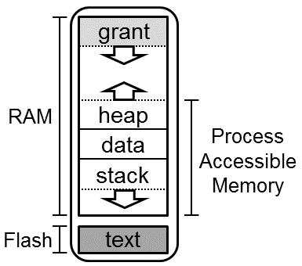

Memory Isolation
=============

This document describes how memory is isolated in Tock, in terms of access
permissions of the kernel and processes.  Before reading this, make sure you
have a good understanding of the [design of Tock](Design.md) and the [Tock
memory layout](Memory_Layout.md).

<!-- npm i -g markdown-toc; markdown-toc -i Memory_Isolation.md -->

<!-- toc -->

- [Process Isolation](#process-isolation)
  * [Flash](#flash)
  * [RAM](#ram)

<!-- tocstop -->

Memory isolation is a key property of Tock. Without it, processes could just
access any part of memory, and the security of the entire system would be
compromised. Although Rust preserves memory safety (e.g. no double frees or
buffer overflows) and type safety at compile-time, this doesn't prevent
processes, which can be written in any language, from accessing certain
addresses which they should not have access to in memory. Some other component
is necessary to prevent this from happening, or systems can not safely support
untrusted processes. 

To do this, Tock uses the memory protection units (MPU)
provided by many embedded microcontrollers. The MPU is a hardware component
which can configure access permissions for certain memory regions. Three
fundamental access types can be set for these memory regions: read (R), write
(W) and execute (X). Full access implies all three access types are allowed in a
certain memory region.

Since processes are by default not allowed to access each others' memory, the MPU
has to be configured for each process based on where that process is in flash
and what memory it has allocated to it. The MPU configuration is hence
different for each process. Therefore, with each context switch to a userland
process, Tock reconfigures the MPU for that process.

When the system is executing kernel code, the MPU is disabled. This means there
are no hardware restrictions preventing the kernel from accessing the entire
address space. In practice however, the Rust type system restricts what the
kernel can do. For example, a capsule (which cannot use `unsafe`) cannot access
a process's memory because it cannot create and dereference an arbitrary
pointer. In general, Tock tries to minimize the amount of trusted code (i.e.
code that can call `unsafe`), and tries to encapsulate code that does need
`unsafe` to make it clear what that code does and how to use it in a manner that
does not violate overall system safety.

## Process Isolation

From an architecture perspective, processes are considered to be arbitrary code
that may be buggy or even malicious. Therefore, Tock takes care to ensure that
misbehaving applications do not compromise the integrity of the overall system.

### Flash

Flash is the nonvolatile memory space on a microcontroller. Generally, processes
cannot access arbitrary addresses in flash, and are certainly prohibited from
accessing bootloader or kernel code. They are also prohibited from reading or
writing the nonvolatile regions of other processes.

Processes generally have access to their own memory in flash. Certain regions,
including the Tock Binary Format (TBF) header and a protected region after the
header, are read-only, as the kernel must be able to ensure the integrity of the
header. In particular, the kernel needs to know the total size of the app to find
the next app in flash. The kernel may also wish to store nonvolatile information
about the app (e.g. how many times it has entered a failure state) that the app
should not be able to alter.

The remainder of the app, and in particular the actual code of the app, is
considered to be owned by the app. The app can read the flash to execute its own
code. If the MCU uses flash for its nonvolatile memory the app can not likely
directly modify its own flash region, as flash typically requires some hardware
peripheral interaction to erase or write flash. In this case, the app would
require kernel support to modify its flash region.

### RAM

Process RAM is memory space divided between all running apps. The figure below
shows the memory space of a process.

A process has full access to a portion of its own RAM region. A segment of the
RAM region, called the grant region, is reserved for use only by the kernel on
behalf of the process. Because it contains kernel data structures, processes
cannot read or write the grant region.

The remainder of the process's memory region can be used as the process sees
fit, likely for a stack, heap, and data section. The process entirely controls
how these are used. There are `mem` syscalls that the process can use to inform
the kernel of where it has placed its stack and heap, but these are entirely
used for debugging. The kernel does not need to know how the process has
organized its memory for normal operation.

Processes can choose to explicitly share portions of their RAM with the kernel
through the use of `allow` syscalls. This gives capsules read/write access to
the process's memory for use with a specific capsule operation.

Processes can communicate with each other through an [inter-process
communication (IPC) mechanism](tutorials/05_ipc.md). To use IPC, processes
specify a buffer in their RAM to use as a shared buffer, and then notify the
kernel that they would like to share this buffer with other processes. Then,
other users of this IPC mechanism are allowed to read and write this buffer.
Outside of IPC, a process is never able to read or write other processes' RAM.
