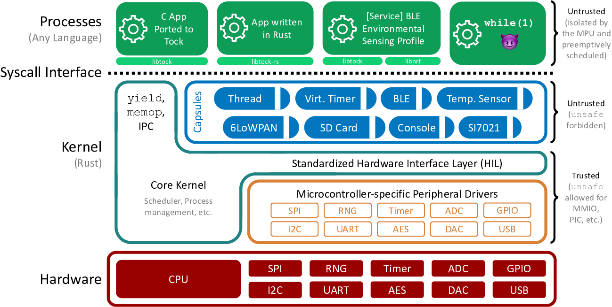

# Tock Overview

Tock is a secure, embedded operating system for Cortex-M and RISC-V
microcontrollers. Tock assumes the hardware includes a memory protection unit
(MPU), as systems without an MPU cannot simultaneously support untrusted
processes and retain Tock's safety and security properties. The Tock kernel and
its extensions (called *capsules*) are written in Rust.

Tock can run multiple, independent untrusted processes written in
any language. The number of processes Tock can simultaneously support
is constrained by MCU flash and RAM. The Tock scheduler is preemptive and
uses a round-robin policy. Tock uses a microkernel architecture: complex
drivers and services are often implemented as untrusted processes, which
other processes, such as applications, can invoke through inter-process
commmunication (IPC).

This document gives an overview of Tock's architecture, the different
classes of code in Tock, the protection mechanisms it uses, and how this
structure is reflected in the software's directory structure.

<!-- npm i -g markdown-toc; markdown-toc -i Overview.md -->

<!-- toc -->

- [Tock Architecture](#tock-architecture)
- [Tock Directory Structure](#tock-directory-structure)

<!-- tocstop -->

## Tock Architecture

The above Figure shows Tock's architecture. Code falls into one of three
categories: the *core kernel*, *capsules*, and *processes*.

The core kernel and capsules are both written in Rust. Rust is a
type-safe systems language; other documents discuss the language and
its implications to kernel design in greater detail, but the
key idea is that Rust code can't use memory differently than intended
(e.g., overflow buffers, forge pointers, or have pointers to dead
stack frames). Because these restrictions prevent many things that
an OS kernel has to do (such as access a peripheral that exists at a
memory address specified in a datasheet), the very small core kernel
is allowed to break them by using "unsafe" Rust code. Capsules,
however, cannot use unsafe features. This means that the core kernel
code is very small and carefully written, while new capsules added
to the kernel are safe code and so do not have to be trusted.

Processes can be written in any language. The kernel protects itself and
other processes from bad process code by using a hardware memory
protection unit (MPU). If a process tries to access memory it's not
allowed to, this triggers an exception. The kernel handles this exception
and kills the process.

The kernel provides four major system calls:

  * command: makes a call from the process into the kernel
  * subscribe: registers a callback in the process for an upcall from the kernel
  * allow: gives kernel access to memory in the process
  * yield: suspends process until after a callback is invoked

Every system call except yield is non-blocking. Commands that
might take a long time (such as sending a message over a UART)
return immediately and issue a callback when they complete.
The yield system call blocks the process until a callback
is invoked; userland code typically implements blocking
functions by invoking a command and then using yield to wait
until the callback completes.

The command, subscribe, and allow system calls all take a driver
ID as their first parameter. This indicates which driver in the
kernel that system call is intended for. Drivers are capsules that
implement the system call.

## Tock Directory Structure

Tock has several principal code directories.

- **arch**: stores architecture-specific code. I.e., code that
is Cortex-M0 and Cortex-M4 specific. This includes code for performing
context switches and making system calls (trapping from user code to
kernel code).

- **boards**: contains code for specific Tock platforms, such as
the imix, the Hail, and the nrf52dk. This is typically the structure
that defines all of the capsules the kernel has, the code to configure the
MCU's IO pins into the proper states, initializing the kernel and loading
processes. The principal file in this directory is `main.rs`, and the
principal initialization function is `reset_handler` (which executes
when the MCU resets). The board code also defines how system call device
identifiers map to capsules, in the `with_driver` function.

- **capsules**: contains MCU-independent kernel extensions that
can build on top of chip-specific implementations of particular peripherals.
Some capsules provide system calls. For example, the `spi` module in capsules
builds on top of a chip's SPI implementation to provide system calls on
top of it.

- **chips**: contains microcontroller-specific code, such as the
implementations of SPI, I2C, GPIO, UART, and other microcontroller-specific
code. The distinction between chips and boards is the difference between
a microcontroller and a full platform. For example, many microcontrollers
have multiple UARTs. Which UART is the principal way to communicate with
Tock, or which is used to control another chip, is defined by how the chip
is placed on board and which pins are exposed. So a chip provides the UART
implementation, but a board defines which UART is used for what.

- **doc**: contains the documentation for Tock, including
specifications for internal interfaces and tutorials.

- **kernel**: contains microcontroller-independent kernel code,
such as the scheduler, processes, and memory management. This directory
and arch are where all core kernel code reside.

- **libraries**: contains libraries that we use internally and share
externally. Several primitives have been created for Tock that we think could
also be useful to other projects. This is a location where each crate is
located.

- **tools**: contains associated tools to help in compilation and
code maintenance, such as checking code formatting, converting binaries,
and build scripts.

- **vagrant**: contains information on how to get Tock running in a
virtual machine-esque environment.
