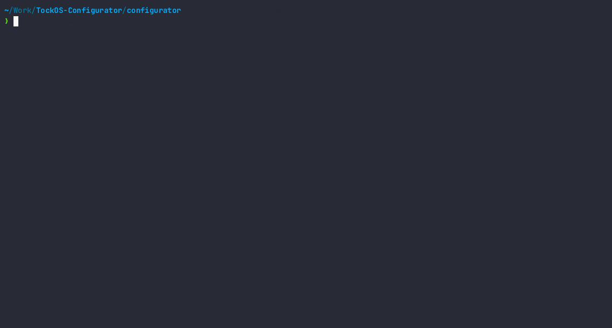

Tock Configurator
=================

The Tock Configurator offers a **TUI** (Terminal User Interface) similar to Linux's `menuconfig` to configure Tock (capsules and kernel resources). It also provides a generator to create the `main.rs` based on the configuration.



The workspace has the following crates:

- [`configurator/`](./configurator/Configurator.md): The **TUI** menu used for visually configuring a platform. This part of the configuration process is meant to be as agnostic as possible to the **Tock**-specific implementations. The application saves the configuration into a `JSON` file named `.config.json`.

- [`parse/` and `parse-macros/`](./configurator/Parse.md): Parse is the *"glue"* crate for the configurator and the generator. This crates deals with parsing the configuration components into **Rust** code, providing helper types and procedural macros.

- [`generator/`](./configurator/Generator.md): The crate that can be exported in order to fully parse a configuration file into a `main.rs` file.

- [`chips/`](./configurator/Chips.md): Supported chips crates, based on the traits provided by the `parse` crate

# Building and Installation

```shell
$ cargo install --path configurator # install the configurator binary
```

# Usage

```shell
$ tock-configurator # run the configuration menu TUI app
```

After configuring the platform, you should see a file named `.config.json`, similar
to this:

```json
{
  "TYPE": "Microbit",
  "CAPSULES": {
    "ALARM": {
      "timer": [
        "Rtc"
      ]
    },
    "CONSOLE": {
      "uart": [
        "Uart0"
      ],
      "baud_rate": 112500
    }
  },
  "SCHEDULER": "Cooperative",
  "PROCESS_COUNT": 0,
  "STACK_SIZE": 2304,
  "SYSCALL_FILTER": "None"
}
```

The crate `tock-generator` deals with parsing the configuration file into
`Rust` code. The main purpose was for it to be used in a build script, so that the file
would be created and integrated into the build flow.

```rust
// build.rs
use tock_generator::{TockMain, Nrf52833};

fn main() {
    let tock_main = TockMain::from_json(Nrf52833::default(), ".config.json").unwrap();
    tock_main.write_to_file("main.rs").unwrap();

    // The rest of the build script... 
}
```

> Under `tock-configurator/generator/examples` is found an example of using the generator as a CLI tool.

**Currently work in progress 🚧**
