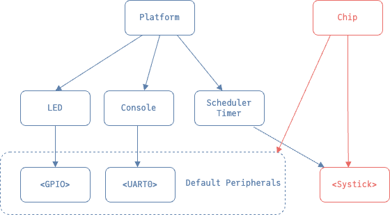

Tock Generator
==============

A code generator for **TockOS** platforms' `main.rs` files.

The generator takes as input a *TockOS configuration file* in JSON format,
and generates a `main.rs` board file.

## Crate

This crate is used to export the `TockMain` struct that is constructed over a given `JSON` configuration file.
The constructor deserializes the given `parse::Config` and generates a `parse::Context` from it, which it uses
to build the code for the `main` file.

The dependency graph generated comes from two roots: the **Platform** and the **Chip**. These are the return
values for the `setup` function used for the board's `main` function. Each dependency chain is defined by the
implementation of the `parse::Component` trait, through the `dependencies` function.



### Example
```rust
use tock_generator::{TockMain, Nrf52833};

// This errors should be handled.
let tock_main = TockMain::from_json(Nrf52833::default(), ".config.json")?;
tock_main.write_to_file("main.rs")?;
```

> The purpose of this crate was to be used in the future in the build script of a board. Upon feedback,
it could be also moved as a separate tool or the execution included as a flag in `tock-configurator`.

