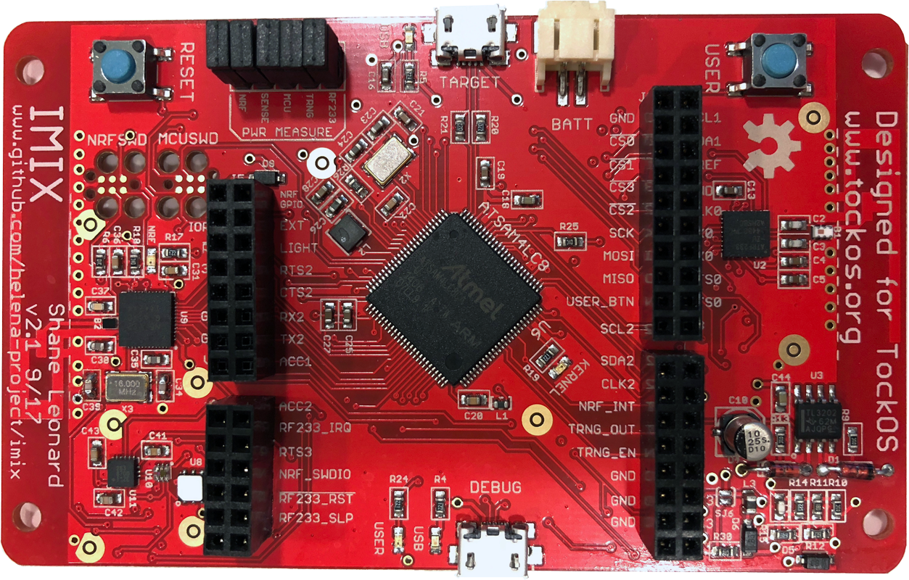

## Tock

A secure operating system for microcontrollers

  * Kernel components in Rust

  * Type-safe API for safe driver development

  * Hardware isolated processes for application code

## Microcontrollers

System-on-a-chip with integrated flash, SRAM, CPU and a bunch of hardware
controllers.

Typically:

  * Communication: UART, SPI, I2C, USB, CAN...

  * External I/O: GPIO, external interrupt, ADC, DAC

  * Timers: RTC, countdown timers

Maybe...

  * Radio (Bluetooth, 15.4)

  * Cryptographic accelerators

  * Other specialized hardware...

## Low Resource

  * 10's of µA average power draw

  * 10's of kBs of RAM

  * Moderate clock speeds

## Use cases

  * Security applications (e.g. authentication keys)

  * Sensor networks

  * Programmable wearables

  * PC/phone peripherals

  * Home/industrial automation

  * Flight control

## Two types of components: capsules and processes


## Two types of scheduling: cooperative and preemptive


## Agenda Today

|             |             |
|-------------+-------------|
| 09:30-10:40 | Intro to Tock, Development Environment & Hardware |
| 10:40-11:00 | Coffee break |
| 11:00-12:00 | Hardware setup and installing apps |
| 12:00-13:30 | Lunch        |
| 13:30-15:20 | Find and fix a real world bug |
| 15:20-15:40 | Coffee break |
| 15:40-17:30 | Choose your own adventure |

# Part 1: Hardware, tools, and development environment

* * *



## imix

  - Atmel SAM4L, Cortex-M4, 64 kB RAM, 256 kB flash

  - Nordic NRF51 Bluetooth SoC

  - 802.15.4 radio (6lowpan)

  - Temperature, humidity, and light sensors

  - 2 USBs (target USB + FTDI serial USB)

  - 2 LEDs, 1 "user" button

## Binaries on-board in flash

  - `0x00000`: **Bootloader**: Interact with Tockloader; load code

  - `0x10000`: **Kernel**

  - `0x40000`: **Processes**: Packed back-to-back

## Tools

  * `make`

  * Rust/Cargo (Rust code → Cortex-M)

  * `arm-none-eabi` (C → Cortex-M)

  * `tockloader` to interact with imix and the bootloader

## Tools: `tockloader`

Write a binary to a particular address in flash

```bash
$ tockloader flash --address 0x10000 \
    target/thumbv7em-none-eabi/release/imix.bin
```

Program a process in Tock Binary Format[^footnote]:

```bash
$ tockloader install myapp.tab
```

Restart the board and connect to the debug console:

```bash
$ tockloader listen
```

[^footnote]: TBFs are relocatable process binaries prefixed with headers like
  the package name. `.tab` is a tarball of TBFs for different architectures as
  well as a metadata file for `tockloader`.

## Check your understanding

Turn to the person next to you:

  1. What kinds of binaries exist on a Tock board?  
    _Hint: There are three, and only two can be programmed using `tockloader`._

  2. What steps would you follow to program a process onto imix? What about
     to replace the kernel?

## Answers

  1. The three binaries are the serial bootloader, the kernel, and a series of
     processes. The bootloader can be used to load the kernel and processes, but
     cannot replace itself.

  2. Use `tockloader`:

     * `tockloader install app.tab`

     * `tockloader flash --address 0x10000 imix-kernel.bin`

## Hands-on: Set-up development environment

  3. Compile and program the kernel

  4. (Optional) Familiarize yourself with `tockloader` commands

    * `uninstall`

    * `list`

    * `erase-apps`

  5. (Optional) Add some other apps from the repo, like `blink` and `sensors`


 - Head to <http://j2x.us/tock1> to get started!
 - \tiny ([https://github.com/tock/tock/blob/tutorial-sensys-2018/doc/courses/sensys/environment.md](https://github.com/tock/tock/blob/tutorial-sensys-2018/doc/courses/sensys/environment.md))

# Part 2: User space programming

## System calls

Tock supports five syscalls that applications use to interact with the kernel.

| **Call**  | **Target** | **Description**                  |
|:----------|:----------:|----------------------------------|
| command   | Capsule    | Invoke an operation on a capsule |
| allow     | Capsule    | Share memory with a capsule      |
| subscribe | Capsule    | Register an upcall               |
| memop     | Core       | Modify memory break              |
| yield     | Core       | Block until next upcall is ready |

## C System Calls: `command` & `allow`

```c
// Start an operation
int command(u32 driver, u32 command, int arg1, int arg2);

// Share memory with the kernel
int allow(u32 driver, u32 allow, void* ptr, size_t size);
```

## C System Calls: `subscribe`

```c
// Callback function type
typedef void (sub_cb)(int, int, int, void* userdata);

// Register a callback with the kernel
int subscribe(u32 driver,
              u32 subscribe,
              sub_cb cb,
              void* userdata);
```

## C System Calls: `yield` & `yield_for`

```c
// Block until next callback
void yield(void);

// Block until a specific callback
void yield_for(bool *cond) {
  while (!*cond) {
    yield();
  }
}
```

<!-- ## Example: printing to the debug console

```c
static void putstr_cb(int _x, int _y, int _z, void* ud) {
  putstr_data_t* data = (putstr_data_t*)ud;
  data->done = true;
}

int putnstr(const char *str, size_t len) {
  putstr_data_t data;
  data.buf = str;
  data.done = false;

  allow(DRIVER_NUM_CONSOLE, 1, str, len);
  subscribe(DRIVER_NUM_CONSOLE, 1, putstr_cb, &data);
  command(DRIVER_NUM_CONSOLE, 1, len, 0);
  yield_for(&data.done);
  return ret;
}
``` -->

## Example: printing to the debug console

```c
#define DRIVER_NUM_CONSOLE 0x0001

bool done = false;

static void putstr_cb(int x, int y, int z, void* ud) {
  done = true;
}

int putnstr(const char *str, size_t len) {
  allow(DRIVER_NUM_CONSOLE, 1, str, len);
  subscribe(DRIVER_NUM_CONSOLE, 1, putstr_cb, NULL);
  command(DRIVER_NUM_CONSOLE, 1, len, 0);
  yield_for(&done);

  return SUCCESS;
}
```

## Hands-on: Write a simple application

  3. Get an application running on imix

  4. [Print "Hello World" every second](https://github.com/tock/tock/blob/tutorial-sensys-2018/doc/courses/sensys/exercises/app/solutions/repeat-hello.c)

  5. [Extend your app to sample on-board sensors](https://github.com/tock/tock/blob/tutorial-sensys-2018/doc/courses/sensys/exercises/app/solutions/sensors.c)

 - Head to <http://j2x.us/tock2> to get started!
 - \tiny ([https://github.com/tock/tock/blob/tutorial-sensys-2018/doc/courses/sensys/application.md](https://github.com/tock/tock/blob/tutorial-sensys-2018/doc/courses/sensys/application.md#2-check-your-understanding))

# Part 3: Deliver for the Client

## Debugging in a Multi-app Setting

  * Multiprogramming -> multiple things can go wrong

  * Multiprogramming _enables_ better debugging facilities

    - Monitor individual application state

    - Disable only faulty applications

    - Replace only parts of the system

## The Process Console on imix

Keeps track of system calls and timeslice expirations for each process.

Provides basic debugging facilities over UART:

  * `status`

  * `list`

  * `stop [app_name]`

  * `start [app_name]`

## Our task

  * Fix a "deployed" with two mysteriously named processes:
    - `app1` & `app2`

  * Networked over UDP/6LoWPAN

    - One sends button presses

    - Another sends periodic temperature, humidty and light data

  * Functional, but seem to be draining battery!

_Find and fix the problem!_

## Stay in touch!

<https://www.tockos.org>

<https://github.com/tock/tock>

<tock-dev@googlegroups.com>

\medskip

\hrule

