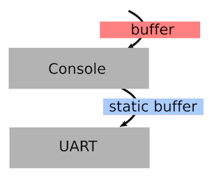

### Tock OS Course Part 2: Adding a New Capsule to the Kernel

The goal of this part of the course is to make you comfortable with the
Tock kernel and writing code for it. By the end of this part, you'll have
written a new capsule that reads a 9DOF (nine degrees of freedom, consisting
f a 3-axis accelerometer, magnetometer, and gyroscope) sensor and outputs
its readings over the serial port.

During this you will:

1. Learn how Tock uses Rust's memory safety to provide isolation for free
2. Read the Tock boot sequence, seeing how Tock uses static allocation
3. Learn about Tock's event-driven programming
4. Write a new capsule that reads a 3DOF sensor and prints it over serial

#### 1. Listen to presentation on Tock's kernel and capsules (20 min)

This part of the course will start with a member of the Tock development
team presenting its core software architecture. This will explain how a
Tock platform has a small amount of trusted (can use `unsafe`) code, but
the bulk of the kernel code is in *capsules*, which cannot violate Rust's
safety guarantees. It'll also explain how RAM constraints lead the Tock
kernel to rely on static allocation and use a purely event-driven execution
model.

This presentation will give you the intellectual framework to understand
why capsules work as they do, and understand what you'll be doing in the rest
of this part of the course. After this presentation, please answer the
following questions:

#### 2. Brief quiz (15 min)

1. What is a `VolatileCell`? Find an example of its use and explain why it's used there. Hint: look inside `chips/sam4l/src`.
2. What is a `TakeCell`? Describe a use case when a `TakeCell` is preferable to a standard `Cell`.

#### 3. Read the Tock boot sequence (20m)

Open `boards/hail/src/main.rs` in your favorite editor. This file defines the
Hail platform: how it boots, what capsules it uses, and what system calls it
supports for userland applications.

Find `struct Hail`. This declares the structure representing the
platform: it has many fields, all of which are capsules, except `ipc`
for inter-process procedure calls (IPC). You'll notice two
things. First, every field is a reference to an object with a static
lifetime. Second, all of the capsules take a lifetime as a parameter
and this lifetime is `` `static``.  This reflects the fact that the
Tock kernel doesn't have a dynamic memory pool: all of its RAM state
is statically allocated. The implementations of these capsules,
however, don't assume this in case dynamic allocation is needed in the
future.

The method `reset_handler` is invoked when the chip resets (i.e., boots).
It's pretty long because Hail has a lot of drivers that need to be created
and initialized, and many of them depend on other, lower layer abstractions
that need to be created and initialized as well. Take a look at the first
few lines. You'll see that the boot sequence
initializes memory (copies initialized variables into RAM, clears the BSS),
sets up the system clocks, and configures the GPIO pins.

Next, it initializes the system console, which is what turns calls to `print!`
into bytes sent to the USB serial port:

    let console = static_init!(
        Console<usart::USART>,
        Console::new(&usart::USART0,
                     115200,
                     &mut console::WRITE_BUF,
                     kernel::Container::create()));
    hil::uart::UART::set_client(&usart::USART0, console);

You're going to use this capsule to output data from the 9DOF sensor,
so it's a useful example to see how you instantiate and initialize capsules.
The `static_init!` macro is simply an easy way to allocate a static
variable with a call to `new`. The first parameter is the type, the second
is the expression to produce an instance of the type. This call creates
a `Console` that uses serial port 0 (`USART0`) at 115200 bits per second.

Notice that you have to pass a write buffer to the console for it to use:
this buffer has to have a `` `static`` lifetime. This is because low-level
hardware drivers, especially those thayt use DMA, require `` `static`` buffers.
Since Tock doesn't promise when a DMA operation will complete, and you
need to be able to promise that the buffer outlives the operation, the
one lifetime that is assured to be alive at the end of an operation is
`` `static``. So other code which has buffers
without a `` `static`` lifetime, such as userspace processes, can use the
`Console`, it copies them into its own internal `` `static`` buffer before
passing it to the serial port. So the buffer passing architecture looks like
this:

The final parameter, the `Container`, is for handling system calls:
you don't need to worry about it for now.

Next, jump to around line 360, where a `Hail` structure is allocated. Note
that its `console` field is initialized to the `console` capsule that
was allocated in the code above. Around line 380, you'll see the console
is initialized,

    hail.console.initialize();

which configures the serial port to be as text consoles
expect (8 data bits, 1 stop bit, no parity bit, no hardware flow control).
Next -- and this is the key part! -- the kernel's debug interface is
connected to the `Console`. Now, kernel debug messages will be printed
on the serial port! Userspace processes can also print messages to the
`Console`, which handles interleaving them correctly.

If you jump down just a few more lines, to line 400, you'll see the code
that loads userspace processes off flash, then starts the kernel main loop:

    kernel::process::load_processes(&_sapps as *const u8,
                                    &mut APP_MEMORY,
                                    &mut PROCESSES,
                                    FAULT_RESPONSE);
    kernel::main(&hail, &mut chip, &mut PROCESSES, &hail.ipc);

#### Brief Quiz (10 min)

Take a look at the implementation of the `debug!` macro in
`kernel/src/debug.rs`. Note that it has an output buffer of size
`BUF_SIZE` (`debug.rs:29`). When the kernel calls `debug!`, does
the macro return when the message has been written to the serial
port (synchronous), or does it return and asynchonrously write
out the debug message? Hint: the call to `subscribe` on line 120
is what starts the write operation, resulting in the `callback` on
line 130.

#### Create a New Capsule (25m)

Now that you've seen how Tock initializes and uses capsules, you're going
to write a new one. This capsule will, when the system boots, start sampling
the 9DOF sensor once a second and printing the results as serial output.

First, because you're going to be modifying the boot sequence of Hail,
make a branch of the Tock repository; this will keep your master
branch clean. You're going to replace the `NineDof` capsule, which
provides access to the FXOS8700 sensor to processes through system
calls, with a capsule that reads the sensor and sends `debug!`
messages with its values.

First, in `capsules/src`, create a new capsule named
`rustconf`. This capsule is going to use two other capsules:
`virtual_alarm` and `fxos8700cq`.  Every second, the capsule will
sample the FXOS and print those values using `debug!`. Your capsule
will use `virtual_alarm` to receive a callback once a second, and
`fxos8700cq` to sample the 9DOF sensor.

Second, add `rustconf` to the capsules crate. In `capsules/src/lib.rs`,
add `pub mod rustconf;` at the bottom of the file.

Third, in `rustconf.rs`, define a generic struct called
`RustConf`. This struct needs two generic type parameters: a lifetime
and a generic data type that implements the trait `time::Alarm`:

    pub struct RustConf<'a, A: time::Alarm + 'a> {

It should have three fields: a reference with lifetime `'a` to a
`hil::ninedof::NineDof``, a reference with lifetime '`a` to a
`time::Alarm`` (`A`), and a `Cell<u32>` to store the interval at which
the capsule should sample.

Fourth (and fifth and sixth!), you'll need three `impl` sections. The
basic one will contain `new`, which has the signature

    pub fn new(driver: &'a hil::ninedof::NineDof,
               alarm: &'a A) -> RustConf<'a, A> {

as well as a method to start the capsule:

    pub fn start(&self, interval: u32) -> ReturnCode {

The second is for `time::Client`, which provides the callback from
the virtual alarm:

    impl<'a, A: time::Alarm + 'a> time::Client for RustConf<'a, A> {
        fn fired(&self) {

The last is for `hil::ninedof::NineDofClient``, which provides the callback
for the 9DOF sensor to signal it has completed a sample:

    impl<'a, A: time::Alarm + 'a> hil::ninedof::NineDofClient for RustConf<'a, A> {
        fn callback(&self, arg1: usize, arg2: usize, arg3: usize) {

The basic logic is that when a `RustConf` is instantiated, its interval is
0. Calling `start` stores the interval in the structure and calls
`alarm` to issue a callback interval ticks in the future. On Hail,
there are 32kHz ticks/second, (it's based off an ultra-low power
32kHz oscillator). So specifying an interval of 32768 (2^15) will
tick once a second.

The `fired` callback requests a reading from the 9DOF sensor. The
9DOF API provides three functions to choose from:

    fn read_accelerometer(&self) -> ReturnCode
    fn read_magnetometer(&self) -> ReturnCode
    fn read_gyroscope(&self) -> ReturnCode

For starters, just call one of the three. You might want to add a
small `debug!` statement in `fired` to make sure it's being
called. Then, in `callback`, print out the three values (`arg1`,
`arg2`, `arg3`) with a `debug!` statement.

`ReturnCode` can take many values. If you wanted to do some detailed
error reporting, you could match on the result. For now, it's OK to
just check that it's `ReturnCode::SUCCESS` and print an error
if it's not.

Go to the top-level Tock directory and `make`. The Tock build process
should try to compile your capsule and include it in the capsules crate.
Once your code is compiling, you incorporate it into the boot
sequence and get it working.

#### Add Your Capsule to the Boot Sequence (15m)

Now that you have the `rustconf` capsule, you need to include it in the
boot sequence so that Tock will initialize and start it. Open
`boards/hail/src/main.rs` and modify `struct Hail`, replacing
the `ninedof` field (which exposes a 9DOF sensor to user space through
system calls) with a `rustconf` field with lifetime `'static` and
whose alarm generic type is a `VirtualMux` with lifetime `'static`
and type `sam4l::ast::Ast<'static>`:

    rustconf: &'static capsules::rustconf::RustConf<'static,
                                                    VirtualMuxAlarm<'static,
                                                                    sam4l::ast::Ast<'static>>>,

Remove `ninedof` from the system call lookup table in `with_driver`:

            11 => f(Some(self.ninedof)), // Comment this out

And, finally, remove the initialization of `ninedof` from the boot sequence:

    let ninedof = static_init!(
        capsules::ninedof::NineDof<'static>,
        capsules::ninedof::NineDof::new(fxos8700, kernel::Container::create()));
    hil::ninedof::NineDof::set_client(fxos8700, ninedof);

Now that `ninedof` has been removed from the kernel, you need to
add `rustconf`. Since `rustconf` doesn't provide a system call
interface, you don't need to add it to `with_driver`. All you need
to do is initialize it and call `start`. The structure for `rustconf`
looks like this:

Recall from your code that the `rustconf` capsule
takes a 9DOF sensor driver (`fxos8700`) and an alarm in its `new`.
So the calls from `rustconf` to those objects can be made
directly, using the references pass in `new`. Hail's
`reset_handler` already creates `fxos8700`. You therefore
need to createa a new virtualized alarm to pass to rustconf.
Find where `reset_handler` creates `let si7021_virtual_alarm`;
you want to repeat this code to create a `rx_virtual_alarm`, which
you pass to `new` so you can create a `rustconf`:

    let rustconf = static_init!(
        capsules::rustconf::RustConf<'static, VirtualMuxAlarm<'static, sam4l::ast::Ast>>,
        capsules::rustconf::RustConf::new(fxos8700, rc_virtual_alarm));

Next, you need to set up the callbacks -- `callback` and `fired`.
This means installing `rustconf` as the client of both
`rc_virtual_alarm` and `fxos8700`.

Finally, start `rustconf`! Do this after `hail` is created
at the end of `reset_handler`:

    hail.rustconf.start(32768);

Compile your kernel and install it with `make program`,
then run `tockloader listen`. If everything is working
correctly, you should see your debug statement printing
out the sensor values.

#### Extend Your Capsule to Sample the Full 9 Degrees (10m)

Right now, your capsule samples only one of the three
sensors. Let's extend it to sample all 3 sensors.

Since the Tock kernel is non-blocking, you have to do this with event
handlers. Since all three sensors have the same callback, your code
has to keep state on which call was outstanding (e.g., through an
`enum`). When the alarm fires, sample the first sensor. In the first
ready event, orint out the value and sample the second sensor. In the
second event handler, sample the third.
