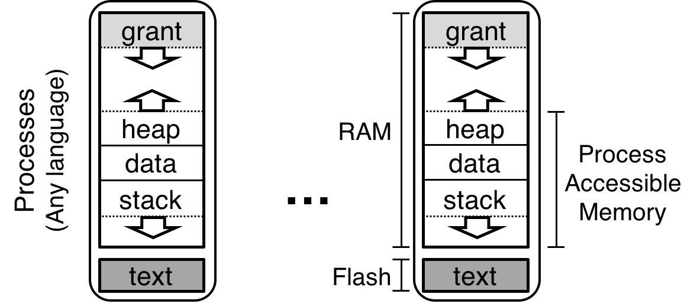

## Tock is a...

  1. Secure

  2. Embedded

  3. Operating System

  4. for Low Resource

  5. Microcontrollers

## Secure


## ~~_Secure_~~ Safe

Tock has isolation primitives that allow you to build secure systems.

## Embedded

### Definition A

> Operating system, applications and hardware are tightly integrated.

### Definition B

> You'll likely be writing the kernel.

## Operating System

Tock itself provides services to components in the system:

  * Scheduling

  * Communication

  * Hardware multiplexing

## Low Resource

  * 10s uA average power draw

  * 10s of kBs of RAM

  * Moderate clock speeds

## Microcontrollers

System-on-a-chip with integrated flash, SRAM, CPU and a bunch of hardware
controllers.

Typically:

  * Communication: UART, SPI, I2C, USB, CAN...

  * External I/O: GPIO, external interrupt, ADC, DAC

  * Timers: RTC, countdown timers

Maybe...

  * Radio (Bluetooth, 15.4)

  * Cryptographic accelerators

  * Other specialized hardware...

## Two types of components: capsules and processes


## Two types of scheduling: cooperative and preemptive


# Part 1: Hardware, tools and development environment

## Hail


## Binaries on-board

  * Bootloader

  * Kernel

  * Processes

## Tools

  * `make`

  * Rust nightly (`asm!`, compiling `core`)

  * `xargo` to automate compiling base libraries

  * `arm-none-eabi` GCC to link binaries

  * `tockloader` to interact with Hail and the bootloader

## Tools: `tockloader`

Write a binary to a particular address in flash

```bash
$ tockloader flash --address 0x1000 \
    target/thumbv7em-none-eabi/release/hail.bin
```

Program a process in Tock Binary Format[^footnote]:

```bash
$ tockloader install myapp.tab
```

Restart the board and connect to the debug console:

```bash
$ tockloader listen
```

[^footnote]: TBFs are relocatable process binaries prefixed with headers like
  the package name. `.tab` is a tarball of TBFs for different architectures as
  well as a metadata file for `tockloader`.

## Check your understanding

  1. What kinds of binaries exist on a Tock board? Hint: There are three, and
     only two can be programmed using `tockloader`.

  2. What are the differences between capsules and processes? What performance
     and memory overhead does each entail? Why would you choose to write
     something as a process instead of a capsule and vice versa?

  3. Is it acceptable for a process to enter an infinte loop? What about a
     capsule?

## Hands-on: Set-up development environment

  1. Compile and flash the kernel

  2. Compile and program `ble-env-sense` service

  3. (Optional) Add some other apps from the repo, like `blink` and `sensors`

  4. (Optional) Familiarize yourself with `tockloader` commands

    * `uninstall`

    * `list`

    * `erase-apps`

# Part 2: The kernel

## Trusted Computing Base (`unsafe` allowed)

  * Hardware Abstraction Layer

  * Board configuration

  * Event & Process scheduler

  * Rust `core` library

  * A few data structures

```
kernel/
chips/
```

## Capsules (`unsafe` not allowed)

  * Virtualization

  * Peripheral drivers

  * Communication protocols (IP, USB, etc)

  * Application logic

```
capsules/
```

## Constraints

### Small isolation units

Breaking a monolithic component into smaller ones should have low/no cost

### Avoid memory exhaustion in the kernel

No heap. Everything is allocated statically.

### Low communication overhead

Communicating between components as cheap as an internal function call. Ideally
inlined.

## Event-driven execution model

```rust
pub fn main<P, C>(platform: &P, chip: &mut C,
                  processes: &mut [Process]) {
    loop {
        chip.service_pending_interrupts();
        for (i, p) in processes.iter_mut().enumerate() {
            sched::do_process(platform, chip, process;
        }

        if !chip.has_pending_interrupts() {
            chip.prepare_for_sleep();
            support::wfi();
        }
    }
}
```

## Event-driven execution model

```rust
fn service_pending_interrupts(&mut self) {
    while let Some(interrupt) = get_interrupt() {
        match interrupt {
            ASTALARM => ast::AST.handle_interrupt(),
            USART0 => usart::USART0.handle_interrupt(),
            USART1 => usart::USART1.handle_interrupt(),
            USART2 => usart::USART2.handle_interrupt(),
            ...
        }
    }
}
```

* * *


## The mutable aliases problem

```rust
enum NumOrPointer {
  Num(u32),
  Pointer(&mut u32)
}

// n.b. will not compile
let external : &mut NumOrPointer;
match external {
  Pointer(internal) => {
    // This would violate safety and
    // write to memory at 0xdeadbeef
    *external = Num(0xdeadbeef);
    *internal = 12345;  // Kaboom
  },
  ...
}
```

## Interior mutability to the rescue

| Type           | Copy-only | Mutual exclusion | Opt.      | Mem Opt. |
|----------------|:---------:|:----------------:|:---------:|:--------:|
| `Cell`         | \cmark{}  | \xmark{}         | \cmark{}  | \cmark{} |
| `VolatileCell` | \cmark{}  | \xmark{}         | \xmark{}  | \cmark{} |
| `TakeCell`     | \xmark{}  | \cmark{}         | \xmark{}  | \cmark{} |
| `MapCell`      | \xmark{}  | \cmark{}         | \cmark{}  | \xmark{} |


* * *

```rust
pub struct Fxos8700cq<'a> {
  i2c: &'a I2CDevice,
  state: Cell<State>,
  buffer: TakeCell<'static, [u8]>,
  callback:
    Cell<Option<&'a hil::ninedof::NineDofClient>>,
}

impl<'a> I2CClient for Fxos8700cq<'a> {
  fn cmd_complete(&self, buf: &'static mut [u8]) { ... }
}

impl<'a> hil::ninedof::NineDof for Fxos8700cq<'a> {
  fn read_accelerometer(&self) -> ReturnCode { ... }
}

pub trait NineDofClient {
  fn callback(&self, x: usize, y: usize, z: usize);
}
```

## Check your understanding

  1. What is a `VolatileCell`? Can you find some uses of `VolatileCell`, and do
     you understand why they are needed? Hint: look inside `chips/sam4l/src`.

  2. What is a `TakeCell`? When is a `TakeCell` preferable to a standard
     `Cell`?

# Hands-on: Write and add a capsule to the kernel

# Part 3: User space

## System calls

| **Call**  | **Target** | **Description**                  |
|:----------|:----------:|----------------------------------|
| command   | Capsule    | Invoke an operation on a capsule |
| allow     | Capsule    | Share memory with a capsule      |
| subscribe | Capsule    | Register an upcall               |
| memop     | Core       | Modify memory break              |
| yield     | Core       | Bloc until next upcall is ready  |

## System calls: Rust

```rust
pub unsafe fn command(major: u32, minor: u32,
  arg: isize) -> isize;

pub unsafe fn allow(major: u32, minor: u32,
                    slice: &[u8]) -> isize;

type ExternFn =
  extern fn (usize, usize, usize, *const usize);

pub unsafe fn subscribe(major: u32, minor: u32,
  cb: ExternFn, ud: usize) -> isize {

pub fn yieldk();
pub fn yieldk_for<F: Fn() -> bool>(cond: F) {
    while !cond() { yieldk(); }
}
```

## Example: printing to the debug console

```rust
pub fn write(string: Box<[u8]>) {
    let done: Cell<bool> = Cell::new(false);
    syscalls::allow(DRIVER_NUM, 1, string);
    syscalls::subscribe(DRIVER_NUM, 1, callback,
          &done as *const _ as usiz);
    syscalls::command(DRIVER_NUM, 1, string.len());
    yieldk_for(|| done.get())
}

extern fn callback(_: usize, _: usize, _: usize,
                   ud: *const usize) {
    let done: &Cell<bool> = unsafe {
        mem::transmute(ud)
    };
    done.set(true);
}
```

## Process memory layout



## Current Rust userland

### Supported drivers

  * Debug console

  * Timer

  * Sensors:

    * Accelerometer & magnetometer

    * Ambient light

    * Temperature

### Caveats

  * No global variables allowed!

    * Waiting on LLD 5.0 to be released this month

  * Fixed code offset

  * Blocking library calls only

## Check your understanding

1. How does a process perform a blocking operation? Can you draw the flow of
   operations when a process calls `delay_ms(1000)`?

2. What is a Grant? How do processes interact with grants? Hint: Think about
   memory exhaustion.

# Hands-on: Write a BLE environment sensing application
