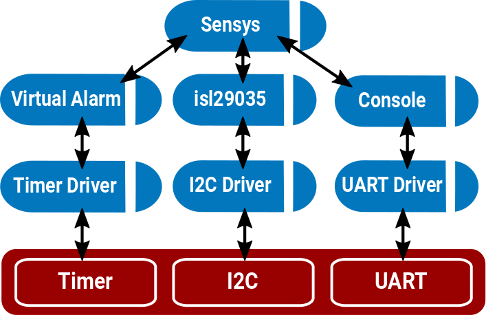

## Adding a New Capsule to the Kernel

- [Intro](README.md)
- [Getting started with Tock](environment.md)
- [Write an environment sensing BLE application](application.md)
- Add a new capsule to the kernel

The goal of this part of the course is to give you a little bit of experience
with the Tock kernel and writing code for it. By the end, you'll
have written a new capsule that reads a light sensor and outputs its readings
over the serial port.

During this you will:

1. Learn how Tock uses Rust's memory safety to provide isolation for free
2. Read the Tock boot sequence, seeing how Tock loads processes
3. Learn about Tock's event-driven programming
4. Write a new capsule that reads a light sensor and prints it over serial

## 1. Listen to presentation on Tock's kernel and capsules (15m)

This part of the course will start with a member of the Tock development
team presenting its core software architecture. This will explain how a
Tock platform has a small amount of trusted code (meaning the code can use
Rust's `unsafe` features), but the bulk of the kernel code is in *capsules*,
which cannot violate Rust's safety guarantees. It'll also explain how RAM
constraints lead the Tock kernel to rely on static allocation and use a purely
event-driven execution model.

This presentation will give you the intellectual framework to understand
why capsules work as they do, and understand what you'll be doing in the rest
of this part of the course.

## 2. Check your understanding

1. How are capsules isolated from one another, such that one cannot access the
   other's memory?
2. What is `'static` and why does the kernel use it for many references?

## 3. The Tock boot sequence (10m)

> The goal of this section is to give you an overview of how everything fits
> together. If you aren't familiar with Rust, don't stress too much about the
> syntax details, which can be a bit gnarly. Just try to read through the code
> here so you understand when things are getting called and how things are
> wired together.

Open `doc/courses/sensys/exercises/board/src/main.rs` in your favorite editor.

This file defines a modified version of the Hail platform for this tutorial:
how it boots, what capsules it uses, and what system calls it supports for
userland applications. This version of the platform includes an extra "sensys"
capsule, which you will implement in the rest of this tutorial.

Build this modified board now:

    cd doc/courses/sensys/exercises/board
    make

Rust will emit a preview of coming attractions as it warns about some of the
unused stubs we've included:

    ...
    warning: field is never used: `light`
     --> /tock/doc/courses/sensys/exercises/capsule/src/sensys.rs:9:5
      |
    9 |     light: &'a AmbientLight,
      |     ^^^^^^^^
    ...

### 3.1 How is everything organized?

Find the declaration of `struct Hail` around line 50.
This declares the structure representing the platform. It has many fields,
all of which are capsules. These are the capsules that make up the Hail
platform. For the most part, these map directly to hardware peripherals,
but there are exceptions such as `IPC` (inter-process communication).
In this tutorial, you'll be using the first two capsules, `console` and
`sensys`.

Recall the discussion about how everything in the kernel is statically
allocated? We can see that here. Every field in `struct Hail` is a reference to
an object with a static lifetime.

As we walk through the rest of the boot process, we will construct a `Hail`
structure. Once everything is set up, the board passes the constructed `hail`
to `kernel::main` and the kernel is off to the races.

### 3.2 How are capsules created?

Scroll down a bit to line 171 to find the `reset_handler`. This is the first
function that's called on boot. It first has to set up a few things for the
underlying MCU (the `sam4l`). Around line 190, we create and initialize the
system console capsule, which is what turns prints into bytes sent to the USB
serial port:

```rust
let console = static_init!(
    Console<usart::USART>,
    Console::new(&usart::USART0,
                 115200,
                 &mut console::WRITE_BUF,
                 kernel::Container::create()));
hil::uart::UART::set_client(&usart::USART0, console);
```

The `static_init!` macro allocates a static variable with a call to
`new`. The first parameter is the type, the second is the expression
to produce an instance of the type. This call creates a `Console` that
uses serial port 0 (`USART0`) at 115200 bits per second. The capsule needs
a mutable buffer to handle outgoing messages, and that is passed in here as
well. For convenience the actual buffer is defined in the console's source file,
but it could be defined here in the `main.rs` file instead. The capsule also
needs to be able to store per-application state, and the mechanism to allow that
(the `Container`) is also setup. Finally, once the `console` object exists,
we setup the callback chain so that events triggered by the `USART0` hardware
are correctly passed to the `console` object.


### 3.4 Let's make a Hail object (including your new capsule)!

After initializing the console, `reset_handler` creates all of the
other capsules that are needed by the Hail platform. If you look around
line 258, it initializes an instance of the `Sensys` capsule:

```rust
/* 1 */    let sensys_virtual_alarm = static_init!(
               VirtualMuxAlarm<'static, sam4l::ast::Ast>,
               VirtualMuxAlarm::new(mux_alarm));
/* 2 */    let sensys = static_init!(
               sensys::Sensys<'static, VirtualMuxAlarm<'static, sam4l::ast::Ast>>,
               sensys::Sensys::new(sensys_virtual_alarm, isl29035));
/* 3 */    hil::sensors::AmbientLight::set_client(isl29035, sensys);
/* 4 */    sensys_virtual_alarm.set_client(sensys);
```

This code has four steps:

1. It creates a software alarm, which your `sensys` capsule will use to
receive callbacks when time has passed.

2. It instantiates an `Sensys` object.
   - Recall that the first parameter to `static_init!` is the type, and the
     second is the instantiating function. The generic type `sensys::Sensys`
     has two parameters:
       - a lifetime: `'static`
       - the type of its software alarm: `VirtualMuxAlarm<'static, sam4l::ast::Ast>`).
   - It's instantiated with a call to `new` that takes two parameters, a
     reference to the software alarm (`sensys_virtual_alarm`) and a reference to
     a light sensor (`isl29035`).

3. It sets the client (the struct that receives callbacks) of the ambient
light sensor to be the `sensys` structure.

4. Finally, it sets the client (the struct that receives callbacks) of the
software alarm to be the `sensys` structure.

After everything is wired together, the picture looks something like this:




By the time we get down to around line 396, we've created all of the needed
capsules, and the boot sequence populates a Hail structure:

```rust
let hail = Hail {
    console: console,
    sensys: sensys,
    ...
```

Around line 431, the boot sequence calls `start` on the `sensys` capsule, telling
it to start its service—this is where we will hook in in a moment.

Finally, at the very end, the kernel's main loop begins.

## 4. Create a "Hello World" capsule (15m)

Let's start by making sure there are no apps installed, as we'll be modifying
the kernel in a way that will break the application from the previous tutorial:

```bash
$ tockloader erase-apps
```

Now that you've seen how Tock initializes and uses capsules, including your
`Sensys` capsule, you're going to fill in the code for `Sensys.` At the end of
this section, your capsule will sample the light sensor and print the results
as serial output. But you'll start with something simpler: printing
"Hello World" to the debug console once on boot.

Open the capsule `doc/courses/sensys/exercises/capsule/src/sensys.rs`. The kernel
boot sequence already includes this capsule, but its code is empty. Go to the
`start` method in the file, it looks like;


```rust
fn start(&self) -> ReturnCode {
```

Eventually, the `start` method will kick off the state machine for periodic
light readings, but for now, you'll just print "Hello World" to the
debug console and return.  So insert this line into the `start` method:

```rust
debug!("Hello World");
```

Now compile and program your new kernel:

```bash
$ cd doc/courses/sensys/exercises/board
$ make program
    [ ... several warnings here ... ]
$ tockloader listen
No device name specified. Using default "tock"
Using "/dev/ttyUSB0 - Hail IoT Module - TockOS"
Listening for serial output.
TOCK_DEBUG(0): ~/tock/doc/courses/sensys/exercises/capsule/src/sensys.rs:28: Hello World
```

[Sample Solution](https://gist.github.com/alevy/e4cc793d34923e3fc39dee6413dad25b)

## 5. Extend your capsule to print every second (10m)

For your capsule to keep track of time, it depends on another capsule that
implements the Alarm trait—a Rust trait is a mechanism for defining interfaces.
In Tock, an Alarm is a free running, wrap-around counter that can issue a
callback when the counter reaches a certain value.

The [time Hardware Interface Layer (HIL)](https://docs-tockosorg.netlify.com/kernel/hil/time/index.html)
defines several traits: `Alarm`, `Client`, and `Frequency`.

You'll ask `Alarm` when `now` is, and then `set_alarm` for a little bit in the
future. When the alarm triggers, it will call the `fired` callback as
specified by the `time::Client` trait.

### 5.1 When is now, when is one second from now?

First things first, lets figure out when `now` is:

```rust
let now = self.alarm.now();
```

Great! But.. what is `now`? Seconds since the epoch? Nanoseconds from boot?
If we examine [the HIL definition](https://docs-tockosorg.netlify.com/kernel/hil/time/trait.alarm#tymethod.now),
`now` is "current time in hardware clock units."

This is where the type of the Alarm (`A: Alarm + 'a`) in the definition of
`Sensys` comes into play. The type defines the time units. So, calling
`<A::Frequency>::frequency()` will return the number of counter ticks in one
second. Which means we could do:

```rust
let one_second_from_now = now + <A::Frequency>::frequency(); // danger!
```

Unfortunately, things aren't quite that easy.  If you've ever dealt with the
hazards of mixing signed and unsigned numbers in C, implicit type conversions,
and the edge cases that can occur especially when you want to handle wraparound
correctly, you're probably a little nervous.  If we do this addition
incorrectly, then the whole system could pause for an almost entire cycle of
the 32-bit counter. Thankfully, Rust provides a helper function to take care of
cases such as these, `wrapping_add`, which in practice compiles down to the
correct addition instruction:

```rust
let one_second_from_now = now.wrapping_add(<A::Frequency>::frequency());
```

### 5.2 Set the alarm

The [`set_alarm` interface](https://docs-tockosorg.netlify.com/kernel/hil/time/trait.alarm#tymethod.set_alarm) looks like this:

```rust
fn set_alarm(&self, tics: u32);
```

So putting everything together:

```rust
pub fn start(&self) {
    let now = self.alarm.now();
    let one_second_from_now = now.wrapping_add(<A::Frequency>::frequency());
    self.alarm.set_alarm(one_second_from_now);
    debug!{"It's currently {} and we set an alarm for {}.", now, one_second_from_now};
}
```

    TOCK_DEBUG(0): /tock/capsules/src/sensys.rs:24: It's currently 323012278 and we set an alarm for 323028278.


### 5.3 Handle the `fired` callback

Currently, our `fired` callback isn't doing anything. Modify the `fired`
method to print every time it fires and then setup a new alarm so that
the callback will keep triggering every second:

    TOCK_DEBUG(0): /tock/capsules/src/sensys.rs:24: It's currently 326405717 and we set an alarm for 326421717.
    TOCK_DEBUG(1): /tock/capsules/src/sensys.rs:33: It's now 326421717.
    TOCK_DEBUG(2): /tock/capsules/src/sensys.rs:33: It's now 326437718.
    TOCK_DEBUG(3): /tock/capsules/src/sensys.rs:33: It's now 326453718.
    ...

[Sample Solution](https://gist.github.com/ppannuto/64a1c6c5dbad4b2f2efa7f6e216927ce)


## 6. Extend your capsule to print a light reading every second (10m)

Printing hardware timer ticks isn't terribly exciting. Let's adapt this to grab
an ambient light reading every second. In addition to the `time` traits, we can
see at the top of the file that our Sensys capsule makes use of some `sensors`:

```rust
use kernel::hil::sensors::{AmbientLight, AmbientLightClient};
use kernel::hil::time::{self, Alarm, Frequency};

pub struct Sensys<'a, A: Alarm + 'a> {
    alarm: &'a A,
    light: &'a AmbientLight,
}
```

Take a look at the [AmbientLight HIL](https://docs-tockosorg.netlify.com/kernel/hil/sensors/trait.ambientlight).


### 6.1 Print light readings

1. Change the implementation of `time::Client::fired` to trigger a light reading instead of printing.
2. Modify the `sensors::AmbientLightClient::callback` to print the `lux` value

If you've implemented everything correctly, you should no longer have any
warnings when your kernel builds. Try covering you board with your hand, or
shining your phone's light at the board:

    TOCK_DEBUG(0): /tock/capsules/src/sensys.rs:24: It's currently 335508024 and we set an alarm for 335524024.
    TOCK_DEBUG(1): /tock/capsules/src/sensys.rs:40: The ambient light is 352 lux.
    TOCK_DEBUG(2): /tock/capsules/src/sensys.rs:40: The ambient light is 15 lux.
    TOCK_DEBUG(3): /tock/capsules/src/sensys.rs:40: The ambient light is 0 lux.

[Sample Solution](https://gist.github.com/ppannuto/d5f8cbfd0e60c984b0b13024686f3134)

Congratulations! You have now implemented a Tock capsule! Hopefully this gives
you a sense of how you could build other features inside of the Tock kernel.

## 7. Some further questions and directions to explore

Your capsule used the ISL29035 and virtual alarm. Take a look at the
code behind each of these services:

1. Is the ISL29035 sensor on-chip or a separate chip connected over a bus?

2. What happens if you request two ISL29035 readings back-to-back?

3. Is there a limit on how many virtual alarms can be created?

4. How many virtual alarms does the Hail boot sequence create?

## 8. **Extra credit**

Here are some ideas for additional features you could try building.

### 8.1 Read several values into a buffer

Currently, your capsule samples at 1Hz. Modify your capsule to sample
at 10Hz and put the readings into a 10-element buffer. When the buffer
is full, so once per second, output all of the readings to the console,
as well as their average value.

### 8.2 Turn on an LED when the light sensor reads a reading below 30 lux

Add a GPIO pin to your capsule and use it to turn on and off an LED based on
the light sensor readings.

