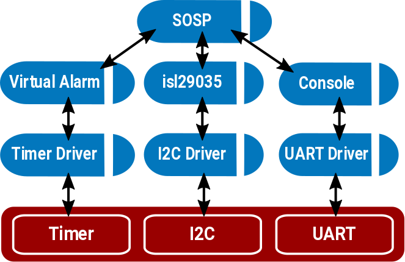

## Adding a New Capsule to the Kernel

The goal of this part of the course is to give you a little bit of experience
with the Tock kernel and writing code for it. By the end, you'll
have written a new capsule that reads a light sensor and outputs its readings
over the serial port.

During this you will:

1. Learn how Tock uses Rust's memory safety to provide isolation for free
2. Read the Tock boot sequence, seeing how Tock loads processes
3. Learn about Tock's event-driven programming
4. Write a new capsule that reads a light sensor and prints it over serial

#### 1. Listen to presentation on Tock's kernel and capsules (15m)

This part of the course will start with a member of the Tock development
team presenting its core software architecture. This will explain how a
Tock platform has a small amount of trusted (can use `unsafe`) code, but
the bulk of the kernel code is in *capsules*, which cannot violate Rust's
safety guarantees. It'll also explain how RAM constraints lead the Tock
kernel to rely on static allocation and use a purely event-driven execution
model.

This presentation will give you the intellectual framework to understand
why capsules work as they do, and understand what you'll be doing in the rest
of this part of the course.

#### 2. Check your understanding

1. How are capsules isolated from one another, such that one cannot access the other's
   memory?
2. What is `` `static`` and why does the kernel use it for many references?

#### 3. The Tock boot sequence (15m)

Open `boards/hail-sosp/src/main.rs` in your favorite editor.

> Note that's `hail-sosp`, not `hail`!

This file defines a modified version of the Hail platform for this tutorial:
how it boots, what capsules it uses, and what system calls it supports for
userland applications. This version of the platform includes an extra capsule,
which you will write.

If you build the `hail-sosp` board, Rust will emit a preview of coming
attractions as it warns about some of the unused stubs we've included:

    ...
    warning: field is never used: `light`
     --> /Volumes/code/helena-project/tock/capsules/src/sosp.rs:9:5
      |
    9 |     light: &'a AmbientLight,
      |     ^^^^^^^^
    ...

##### 3.1 How is everything organized?

Find the declaration of `struct Hail` around line 50.
This declares the structure representing the platform. It has many fields,
all of which are capsules. These are the capsules that make up the Hail
platform. For the most part, these map directly to hardware peripherals,
but there are exceptions such as `IPC` (inter-process communication).
In this tutorial, you'll be using the first two capsules, `console` and
`sosp`.

Recall the discussion about how everything in the kernel is statically
allocated? We can see that here. Every field in `struct Hail` is a reference to
an object with a static lifetime.

The boot process constructs a `Hail` structure. Once everything is set
up, the board passes the constructed `hail` to `kernel::main` and
the kernel is off to the races.

##### 3.2 How are capsules created?

Scroll down a bit to line 171 to find the `reset_handler`. This is the first
function that's called on boot. It first has to set up a few things for the
underlying MCU (the `sam4l`). Around line 190, we create and initialize the
system console capsule, which is what turns calls to `print!` into bytes sent
to the USB serial port:

```rust
let console = static_init!(
    Console<usart::USART>,
    Console::new(&usart::USART0,
                 115200,
                 &mut console::WRITE_BUF,
                 kernel::Container::create()));
hil::uart::UART::set_client(&usart::USART0, console);
```

The `static_init!` macro allocates a static variable with a call to
`new`. The first parameter is the type, the second is the expression
to produce an instance of the type. This call creates a `Console` that
uses serial port 0 (`USART0`) at 115200 bits per second.

Eventually, once all of the capsules have been created, down around line 396
the boot sequence populates a Hail structure with all the capsules:

```rust
let hail = Hail {
    console: console,
    sosp: sosp,
    ...
```


##### 3.4 Let's make a Hail (including your new capsule)!

After initializing the console, `reset_handler` creates all of the
other capsules that are needed by the Hail platform. If you look around
line 258, it initializes an instance of the `Sosp` capsule:

```rust
/* 1 */    let sosp_virtual_alarm = static_init!(
               VirtualMuxAlarm<'static, sam4l::ast::Ast>,
               VirtualMuxAlarm::new(mux_alarm));
/* 2 */    let sosp = static_init!(
               capsules::sosp::Sosp<'static, VirtualMuxAlarm<'static, sam4l::ast::Ast>>,
               capsules::sosp::Sosp::new(sosp_virtual_alarm, isl29035));
/* 3 */    hil::sensors::AmbientLight::set_client(isl29035, sosp);
/* 4 */    sosp_virtual_alarm.set_client(sosp);
```

This code has four steps:

1. It creates a software alarm, which your `sosp` capsule will use to
receive callbacks when time has passed.

2. It instantiates an `Sosp`.
   - Recall that the first parameter to `static_init!` is the type, and the
     second is the instantiating function. `capsules::sosp::Sosp` is a generic
     type with two parameters:
       - a lifetime: `'static`
       - the type of its software alarm: `VirtualMuxAlarm<'static, sam4l::ast::Ast>`).
   - It's instantiated with a call to `new` that takes two parameters, a
     reference to the software alarm (`sosp_virtual_alarm`) and a reference to
     a light sensor (`isl29035`).

3. It sets the client (the struct that receives callbacks) of the ambient
light sensor to be the `sosp` structure.

4. Finally, it sets the client (the struct that receives callbacks) of the
software alarm to be the `sosp` structure.

After everything is wired together, the picture is something like this:




By the time we get down to around line 390, we've created all of the needed
capsules, and it's time to create the actual hail platform structure
(`let hail = Hail {` ...).

Finally, around line 431, the boot sequence calls `start` on the `sosp`
capsule, telling it to start its service.

#### 4. Create a "Hello World" capsule

Now that you've seen how Tock initializes and uses capsules, including your
`Sosp` capsule, you're going to fill in the code for `Sosp.` At the end of
this section, your capsule will sample the light sensor and print the results
as serial output. But you'll start with something simpler: printing
"Hello World" to the debug console once on boot.

Open the capsule `capsules/src/sosp.rs`. The kernel boot sequence already
includes this capsule, but its code is empty. Go to the `start` method in
the file, it looks like;


```rust
fn start(&self) -> ReturnCode {
```

Eventually, the `start` method will kick off the state machine for periodic
light readings, but for now, you'll just print "Hello World" to the
debug console and return:

```rust
debug!("Hello World");
```

Compile and program your new kernel:

```bash
$ # In boards/hail-sosp
$ make program
$ tockloader listen
No device name specified. Using default "tock"
Using "/dev/ttyUSB0 - Hail IoT Module - TockOS"
Listening for serial output.
TOCK_DEBUG(0): /home/alevy/hack/helena/sosp/tock/capsules/src/sosp.rs:18: Hello World
```

[Sample Solution](https://gist.github.com/alevy/e4cc793d34923e3fc39dee6413dad25b)

#### 5. Extend your capsule to print a light reading every second

In order for your capsule to keep track of time, it depends on
another capsule that implements the Alarm trait. In Tock, an Alarm is
a free running, wrap-around counter that can issue a callback when the
counter reaches a certain value.

The [Alarm HIL](https://github.com/helena-project/tock/blob/master/kernel/src/hil/time.rs#L53)
includes several traits, `Alarm`, `Client`, and `Frequency`,
all contained in the `kernel::hil::time` module. You'll use the
`set_alarm` and `now` methods from the `Alarm` trait to set an alarm for
a particular value of the clock. This will call the `fired` callback
in the `time::Client` trait.

To have the software alarm call `fired`, you need to change `start` to
set the alarm to fire. Change your `start` to call `set_alarm` on
`self.alarm`, which has the following signature:

```rust
fn set_alarm(&self, tics: u32);
```

It takes a single parameter, an unsigned 32-bit number for what counter
value to issue the callback. You want to set it one second in the future.
So the argument should add one second to `self.alarm.now()`. How many
ticks is one second? This is where the type of the Alarm (`A: Alarm + 'a` in
the definition of `Sosp` comes into play. The type defines the time units.
So, calling `<A::Frequency>::frequency()` will return the number of counter
ticks in one second.

We can get the current time in counter ticks, and the number of ticks
in a second. All we need to do is add them. If you've ever dealt with
the hazards of mixing signed and unsigned numbers in C, implicit type
conversions, and the edge cases that can occur especially when you
want to handle wraparound correctly, you're probably a little nervous.
If we do this addition incorrectly, then the whole system could pause
for an almost entire cycle of the 32-bit counter. Thankfully, Rust
provides a helper function to take care of cases such as these,
`wrapping_add`, which in practice compiles down to the correct
addition instruction.

If you put all of this together, it should look like:

```rust

pub fn start(&self) {
    self.alarm.set_alarm(
        self.alarm.now().wrapping_add(<A::Frequency>::frequency()));
}
```

This will cause the `fired` callback to execute in one second. Next, fill
in the `fired` callback to request a light reading:


```rust
fn fired(&self) {
    self.light.read_light_intensity();
}
```

Finally, fill in the `callback` in `AmbientLightClient` to print the
reading to the console, and call `start` again to schedule the next alarm:

```rust
fn callback(&self, lux: usize) {
    debug!("Light reading: {}", lux);
    self.start();
}
```

Compile and program your new kernel:

```bash
$ make program
$ tockloader listen
No device name specified. Using default "tock"                                                                         Using "/dev/ttyUSB0 - Hail IoT Module - TockOS"
Listening for serial output.
TOCK_DEBUG(0): /home/alevy/hack/helena/sosp/tock/capsules/sosp.rs:41: Light reading: 352
TOCK_DEBUG(0): /home/alevy/hack/helena/sosp/tock/capsules/sosp.rs:41: Light reading: 352
TOCK_DEBUG(0): /home/alevy/hack/helena/sosp/tock/capsules/sosp.rs:41: Light reading: 352
```

[Sample Solution](https://gist.github.com/alevy/73fca7b0dddcb5449088cebcbfc035f1)

#### 7. Some further questions and directions to explore

Your capsule used the isl29035 and virtual alarm. Take a look at the
code behind each of these services:

1. Is the isl29035 sensor on-chip or a separate chip connected over a bus?

2. What happens if you request isl29035 readings back-to-back?

3. Is there a limit on how many virtual alarms can be created?

4. How many virtual alarms does the Hail boot sequence create?

#### 8. **Extra credit**: Read several values into a buffer

Currently, your capasule samples at 1Hz. Modify your capsule to sample
at 10Hz and put the readings into a 10-element buffer. When the buffer
is full, so once per second, output all of the readings to the console,
as well as their average value.


