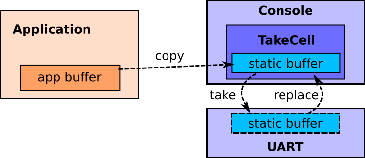

### Tock OS Course Part 2: Adding a New Capsule to the Kernel

The goal of this part of the course is to give you a little bit of experience
with the Tock kernel and writing code for it. By the end of this part, you'll have
written a new capsule that reads a light sensor and outputs its readings over
the serial port.

During this you will:

1. Learn how Tock uses Rust's memory safety to provide isolation for free
2. Read the Tock boot sequence, seeing how Tock uses static allocation
3. Learn about Tock's event-driven programming
4. Write a new capsule that reads a light sensor and prints it over serial

#### 1. Listen to presentation on Tock's kernel and capsules (15m)

This part of the course will start with a member of the Tock development
team presenting its core software architecture. This will explain how a
Tock platform has a small amount of trusted (can use `unsafe`) code, but
the bulk of the kernel code is in *capsules*, which cannot violate Rust's
safety guarantees. It'll also explain how RAM constraints lead the Tock
kernel to rely on static allocation and use a purely event-driven execution
model.

This presentation will give you the intellectual framework to understand
why capsules work as they do, and understand what you'll be doing in the rest
of this part of the course.

#### 2. Check your understanding

1. How are capsules isolated from one another, such that one cannot access the other's
   memory?
2. What is `\`static` and why does the kernel use it for many references?

#### 3. Read the Tock boot sequence (15m)

Open `boards/hail/src/main.rs` in your favorite editor. This file defines the
Hail platform: how it boots, what capsules it uses, and what system calls it
supports for userland applications.

##### 3.1 How is everything organized?

Find the declaration of `struct Hail` (it's pretty early in the file).
This declares the structure representing the platform. It has many fields,
all of which are capsules. These are the capsules that make up the Hail
platform. For the most part, these map directly to hardware peripherals,
but there are exceptions such as `IPC` (inter-process communication).

Recall the discussion about how everything in the kernel is statically
allocated? We can see that here. Every field in `struct Hail` is a reference to
an object with a static lifetime.

The capsules themselves take a lifetime as a parameter, which is currently
always `` `static``.  The implementations of these capsules, however, do not
rely on this assumption.

The boot process is primarily the construction of this `Hail` structure. Once
everything is set up, the board will pass the constructed `hail` to
`kernel::main` and we're off to the races.

##### 3.2 How do capsules get created?

The next lines of `reset_handler` create and initialize the system console,
which is what turns calls to `print!` into bytes sent to the USB serial port:

```rust
let console = static_init!(
    Console<usart::USART>,
    Console::new(&usart::USART0,
                 115200,
                 &mut console::WRITE_BUF,
                 kernel::Container::create()));
hil::uart::UART::set_client(&usart::USART0, console);
```

Eventually, once all of the capsules have been created, we will populate
a Hail structure with them:

```rust
let hail = Hail {
    console: console,
    sosp: sosp,
    ...
```

The `static_init!` macro is simply an easy way to allocate a static
variable with a call to `new`. The first parameter is the type, the second
is the expression to produce an instance of the type. This call creates
a `Console` that uses serial port 0 (`USART0`) at 115200 bits per second.

> ##### A brief aside on buffers:
> 
> Notice that you have to pass a write buffer to the console for it to use:
> this buffer has to have a `` `static`` lifetime. This is because low-level
> hardware drivers, especially those that use DMA, require `` `static`` buffers.
> Since Tock doesn't promise when a DMA operation will complete, and you
> need to be able to promise that the buffer outlives the operation, the
> one lifetime that is assured to be alive at the end of an operation is
> `` `static``. So that other code which has buffers
> without a `` `static`` lifetime, such as userspace processes, can use the
> `Console`, it copies them into its own internal `` `static`` buffer before
> passing it to the serial port. So the buffer passing architecture looks like
> this:
> 
> 
>

##### 3.4 Let's make a Hail!

The code continues on, creating all of the other capsules that are needed
by the hail platform. By the time we get down to around line 360, we've
created all of the capsules we need, and it's time to create the actual
hail platform structure (`let hail = Hail {` ...).


##### 3.5 Loading processes

Once the platform is all set up, the board is responsible for loading processes
into memory:

```rust
kernel::process::load_processes(&_sapps as *const u8,
                                &mut APP_MEMORY,
                                &mut PROCESSES,
                                FAULT_RESPONSE);
```

A Tock process is represented by a `kernel::Process` struct. In principle, a
platform could load processes by any means. In practice, all existing platforms
write an array of Tock Binary Format (TBF) entries to flash. The kernel provides
the `load_processes` helper function that takes in a flash address and begins
iteratively parsing TBF entries and making `Process`es.

#### 4. Create a "Hello World" capsule

Now that you've seen how Tock initializes and uses capsules, you're going to
fill in the code for a new one. At the end of this section, your capsule will sample the
light sensor and print the results as
serial output. But you'll start with something simpler: printing "Hello World"
to the debug console once on boot.

To begin, because you're going to be modifying the implementation of kernel
capsules,  sequence of Hail, make a branch of the Tock repository. This will keep 
your master branch clean.

```bash
# Possibly undo any changes from exploring debug! above:
$ git reset --hard
$ git checkout -b sosp
```

Next, open the capsule `capsules/src/sosp.rs`. The kernel boot sequence already
includes this capsule, but its code is empty. Go to the `start` method in
the file, it looks like;


```rust
fn start(&self) -> ReturnCode {
```

Eventually, the `start` method will kick off the state machine for periodic
light readings, but for now, you'll just print "Hello World" to the
debug console and return:

```rust
debug!("Hello World");
```

Compile and program your new kernel:

```bash
$ make program
$ tockloader listen
No device name specified. Using default "tock"                                                                         Using "/dev/ttyUSB0 - Hail IoT Module - TockOS"
Listening for serial output.
TOCK_DEBUG(0): /home/alevy/hack/helena/sosp/tock/boards/hail/src/accelerate.rs:18: Hello World
```

[Sample Solution](https://gist.github.com/alevy/56b0566e2d1a6ba582b7d4c09968ddc9)

#### 5. Extend your capsule to print "Hello World" every second

In order for your capsule to keep track of time, it will need to depend on
another capsule that implements the Alarm interface. We'll have to do something
similar for reading the accelerometer, so this is good practice.

The Alarm HIL includes several traits, `Alarm`, `Client`, and `Frequency`,
all in the `kernel::hil::time` module. You'll use the `set_alarm` and `now`
methods from the `Alarm` trait to set an alarm for a particular value of the
clock. The `Alarm` trait also has an associated type that implements the
`Frequency` trait which lets us call its `frequency` method to get the clock
frequency.

Modify your capsule to have a field of the type `&'a Alarm` and to accept an
`&'a Alarm` in the `new` function.

Your capsule will also need to implement the `Client` trait so it can
receive alarm events. The `Client` trait has a single method:

```rust
fn fired(&self)
```

Your capsule should now set an alarm in the `start` method, print the debug
message and set an alarm again when the alarm fires.

Finally, you'll need to modify the capsule initialization to pass in an alarm
implementation. Since lots of other capsules use the alarm, you should use a
virtual alarm. You can make a new one like this:

```rust
let my_virtual_alarm = static_init!(
    VirtualMuxAlarm<'static, sam4l::ast::Ast>,
    VirtualMuxAlarm::new(mux_alarm));
```

and you have to make sure to set your capsule as the client of the virtual alarm after initializing it:

```rust
my_virtual_alarm.set_client(my_capsule);
```

Compile and program your new kernel:

```bash
$ make program
$ tockloader listen
No device name specified. Using default "tock"                                                                         Using "/dev/ttyUSB0 - Hail IoT Module - TockOS"
Listening for serial output.
TOCK_DEBUG(0): /home/alevy/hack/helena/sosp/tock/boards/hail/src/accelerate.rs:31: Hello World
TOCK_DEBUG(0): /home/alevy/hack/helena/sosp/tock/boards/hail/src/accelerate.rs:31: Hello World
TOCK_DEBUG(0): /home/alevy/hack/helena/sosp/tock/boards/hail/src/accelerate.rs:31: Hello World
TOCK_DEBUG(0): /home/alevy/hack/helena/sosp/tock/boards/hail/src/accelerate.rs:31: Hello World
```

[Sample Solution](https://gist.github.com/alevy/73fca7b0dddcb5449088cebcbfc035f1)

#### 6. Extend your capsule to sample the accelerometer once a second

The steps for reading an accelerometer from your capsule are similar to using
the alarm. You'll use a capsule that implements the NineDof (nine degrees of
freedom) HIL, which includes the `NineDof` and `NineDofClient` traits, both in
`kernel::hil::sensors`.

The `NineDof` trait includes the method `read_accelerometer` which initiates an
accelerometer reading. The `NineDofClient` trait has a single method for receiving readings:

```rust
fn callback(&self, x: usize, y: usize, z: usize);
```

However, unlike the alarm, there is no virtualization layer for the `NineDof`
HIL (yet!) and there is already a driver used in Hail that exposes the 9dof
sensor to userland. Fortunately, we can just remove it for our purposes.

Remove the `ninedof` field from the `Hail` struct definition:

```rust
ninedof: &'static capsules::ninedof::NineDof<'static>,
```

and initialization:

```rust
ninedof: ninedof,
```

Remove `ninedof` from the system call lookup table in `with_driver`:

```rust
11 => f(Some(self.ninedof)), // Comment this out
```

And, finally, remove the initialization of `ninedof` from the boot sequence:

```rust
let ninedof = static_init!(
    capsules::ninedof::NineDof<'static>,
    capsules::ninedof::NineDof::new(fxos8700, kernel::Container::create()));
hil::ninedof::NineDof::set_client(fxos8700, ninedof);
```

Follow the same steps you did for adding an alarm to your capsule for the 9dof
sensor capsule:

  1. Add a `&'a NineDof` field.

  2. Accept one in the `new` function.

  3. Implement the `NineDofClient` trait.

Now, modify the Hail boot sequence passing in the `fxos8700` capsule, which
implements the `NineDof` trait, to your capsule (it should already be
initialized). Make sure to set your capsule as its client:

```rust
{
  use hil::ninedof::NineDof;
  fxos8700.set_client(my_capsule);
}
```

Finally, implement logic to initiate a accelerometer reading every second and
report the results.


Compile and program your kernel:

```bash
$ make program
$ tockloader listen
No device name specified. Using default "tock"                                                                         Using "/dev/ttyUSB0 - Hail IoT Module - TockOS"
Listening for serial output.
TOCK_DEBUG(0): /home/alevy/hack/helena/sosp/tock/boards/hail/src/accelerate.rs:31: 982 33 166
TOCK_DEBUG(0): /home/alevy/hack/helena/sosp/tock/boards/hail/src/accelerate.rs:31: 988 31 158
```

[Sample solution](https://gist.github.com/alevy/798d11dbfa5409e0aa56d870b4b7afcf)

#### 7. Some further questions and directions to explore

Your capsule used the fxos8700 and virtual alarm. Take a look at the
code behind each of these services:

1. Is the 9DOF sensor on-chip or a separate chip connected over a bus?

2. What happens if you request two 9DOF sensors (e.g., accelerometer and magnetometer)

   back-to-back?
3. Is there a limit on how many virtual alarms can be created?

4. How many virtual alarms does the Hail boot sequence create?

#### 8. **Extra credit**: Write a virtualization capsule for 9dof (∞)

Remember how you had to remove the userspace facing `ninedof` driver from Hail
in order to use the accelerometer in your capsule? That was a bummer...

If you have extra time, try writing a virtualization capsule for the `NineDof`
HIL that will allow multiple clients to use it. This is a fairly open ended
task, but you might find inspiration in the `virtua_alarm` and `virtual_i2c`
capsules.

